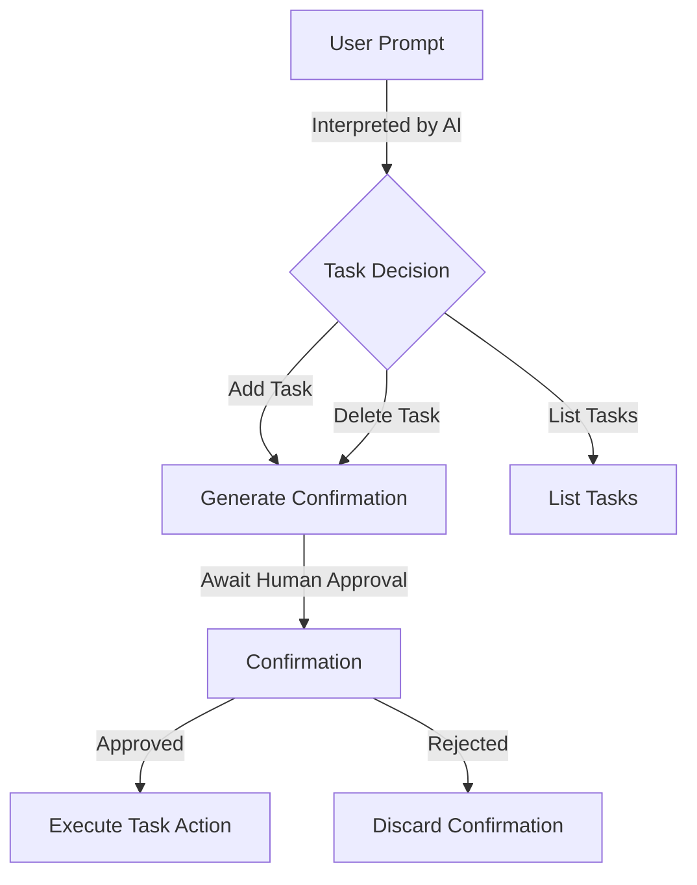

# Agent Task Manager Human in the Loop

This Worker serves as a human-in-the-loop task manager, intelligently deciding when to add tasks, delete tasks, list tasks, or ignore requests. Whenever it decides to add or delete a task, it first generates a "confirmation" that must be approved by a human. This ensures no changes occur without explicit validation.

## Table of Contents
1. [Overview](#overview)
2. [Usage](#usage)
3. [Architecture](#architecture)

## Overview

The Agent Task Manager Human in the Loop is designed to manage tasks with human oversight. It interprets user prompts to decide whether to add, delete, or list tasks, and requires human confirmation for adding or deleting tasks. This ensures that no changes are made without explicit human approval, making it suitable for safety-critical or collaborative environments.

## Usage

To start the project locally, run the following command:
```bash
npx nx dev agent-task-manager-human-in-the-loop
```

### NPM Scripts
- **deploy**: Deploys the application using Wrangler.
- **dev**: Starts the application in development mode.
- **lint**: Lints the source code using Biome.
- **start**: Alias for `dev`.
- **test**: Runs the test suite using Vitest.
- **test:ci**: Runs the test suite in CI mode.
- **type-check**: Checks TypeScript types without emitting files.

### API Endpoints

#### `/query`
Send a user prompt to the AI for interpretation:
```bash
curl -X POST "http://localhost:8787/query" \
  -H "Content-Type: application/json" \
  -d '{
    "agentId": "my-agent-instance",
    "prompt": "Please add a new task called Write Documentation"
  }'
```
- **Response**: Returns a confirmation object if a task is to be added or deleted, or lists tasks if requested.

#### `/confirmations/:confirmationId`
Confirms or rejects a previously created confirmation:
```bash
curl -X POST "http://localhost:8787/confirmations/CONFIRMATION_ID_HERE" \
  -H "Content-Type: application/json" \
  -d '{
    "agentId": "my-agent-instance",
    "confirm": true
  }'
```
- **Response**: Applies the action if confirmed, or discards the confirmation if rejected.

## Architecture

The architecture of the Agent Task Manager Human in the Loop is designed to integrate AI-driven task management with human oversight. The system uses Durable Objects to maintain state across restarts, ensuring continuity of task and confirmation data.

### System Diagram


### Agentic Patterns

#### Tool Use Pattern
The system uses the Tool Use Pattern by dynamically interacting with AI models to interpret user prompts and decide on task actions. This pattern allows the agent to extend its capabilities by leveraging external AI tools for decision-making.