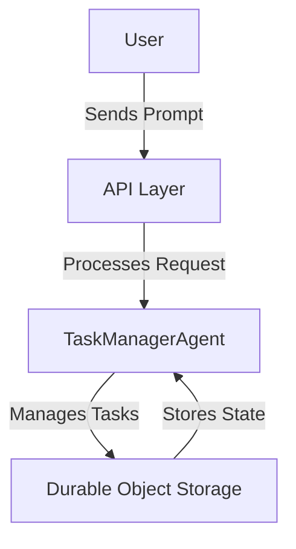
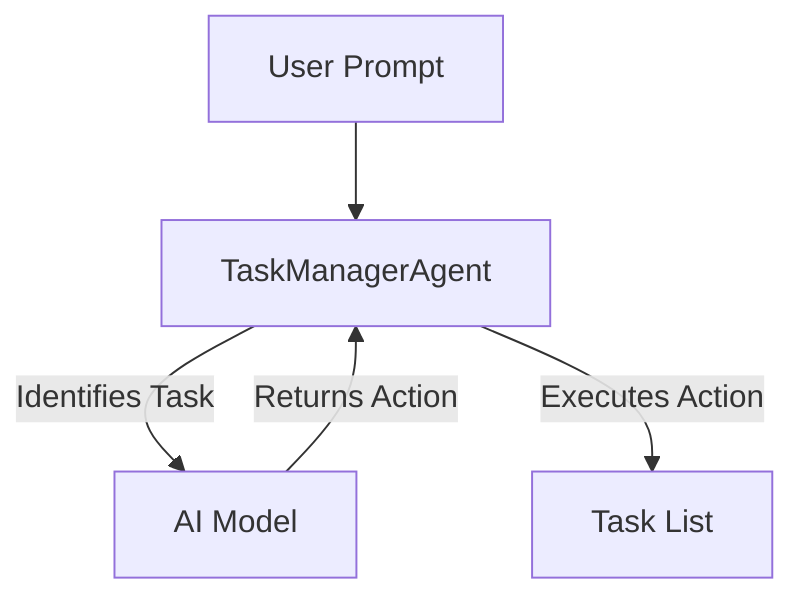

# Agent Task Manager

Agent Task Manager is an intelligent task management system that leverages AI to manage tasks dynamically. It can add, delete, and list tasks based on user prompts, making it a versatile tool for task automation and management.

## Table of Contents
- [Overview](#overview)
- [Usage](#usage)
- [Architecture](#architecture)

## Overview
The Agent Task Manager is designed to automate task management using AI. It utilizes a task manager agent that can interpret user prompts to perform actions such as adding, deleting, or listing tasks. The system is built on a durable object architecture, ensuring state persistence and scalability.

## Usage
To start the project locally, use the following command:
```
npx nx dev agent-task-manager
```

### NPM Scripts
- **deploy**: Deploys the application using Wrangler.
  ```
npx nx deploy agent-task-manager
```
- **dev**: Starts the development server using Wrangler.
  ```
npx nx dev agent-task-manager
```
- **lint**: Lints the source code using Biome.
  ```
npx nx lint agent-task-manager
```
- **start**: Starts the application in development mode.
  ```
npx nx start agent-task-manager
```
- **test**: Runs the test suite using Vitest.
  ```
npx nx test agent-task-manager
```
- **test:ci**: Runs the test suite in CI mode using Vitest.
  ```
npx nx test:ci agent-task-manager
```
- **type-check**: Performs TypeScript type checking.
  ```
npx nx type-check agent-task-manager
```

### API Interaction
The project exposes an API endpoint to interact with the task manager agent.

#### Add a Task
To add a task, send a POST request with the following format:

**Request**
```json
{
  "agentId": "your-agent-id",
  "prompt": "add a new task"
}
```

**Curl Command**
```bash
curl -X POST \
  -H "Content-Type: application/json" \
  -d '{"agentId": "your-agent-id", "prompt": "add a new task"}' \
  http://localhost:8787/
```

#### Delete a Task
To delete a task, send a POST request with the following format:

**Request**
```json
{
  "agentId": "your-agent-id",
  "prompt": "delete task"
}
```

**Curl Command**
```bash
curl -X POST \
  -H "Content-Type: application/json" \
  -d '{"agentId": "your-agent-id", "prompt": "delete task"}' \
  http://localhost:8787/
```

#### List Tasks
To list tasks, send a POST request with the following format:

**Request**
```json
{
  "agentId": "your-agent-id",
  "prompt": "list tasks"
}
```

**Curl Command**
```bash
curl -X POST \
  -H "Content-Type: application/json" \
  -d '{"agentId": "your-agent-id", "prompt": "list tasks"}' \
  http://localhost:8787/
```

## Architecture
The Agent Task Manager is structured around a durable object architecture, which allows for persistent state management and scalability. The main components include the TaskManagerAgent, which handles task operations, and the API layer, which facilitates interaction with the agent.

### System Diagram


### Agentic Patterns
The project employs the Tool Use Pattern, where the TaskManagerAgent dynamically interacts with AI models to determine task actions based on user prompts.

#### Tool Use Pattern


This pattern allows the agent to extend its capabilities by leveraging AI to interpret and act on user inputs dynamically.