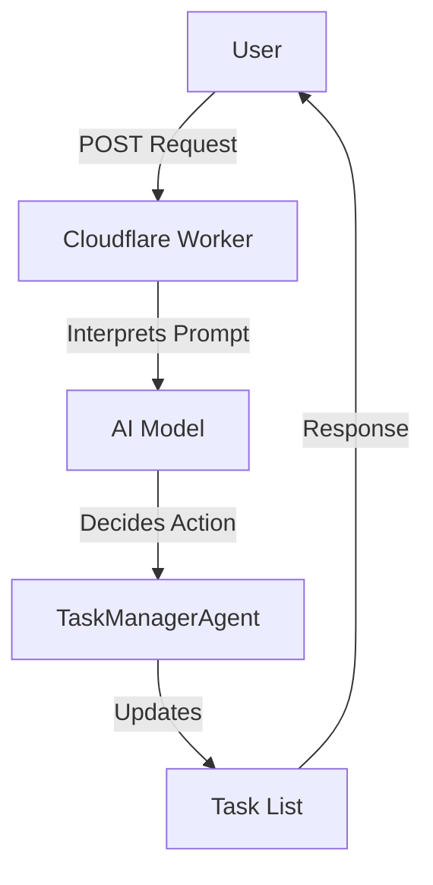

# Agent Task Manager

**Welcome to the Agent Task Manager worker!**  
This is a Cloudflare Worker (with a Durable Object) that listens for task-related instructions and intelligently manages a list of tasks. It is designed to interpret your requests, either adding tasks, removing tasks, listing tasks, or doing nothing if it deems that no changes are needed. The results of its decisions can then be retrieved and incorporated into your applications as you see fit.

## Table of Contents
- [Overview](#overview)
- [Usage](#usage)
- [Architecture](#architecture)
- [Example Usage](#example-usage)
- [Testing and Linting](#testing-and-linting)

## Overview

This worker:
- Provides a POST endpoint at `/` that accepts a JSON payload containing a user prompt.
- Uses advanced AI capabilities to interpret user input and decide the most appropriate task-based action:
  1. **Add** a new task,  
  2. **Delete** an existing task,  
  3. **List** all existing tasks,  
  4. **Do nothing** (if the query does not suggest a modification to the task list).
- Persists these tasks in a Durable Object called `TASK_MANAGER_AGENT`.

## Usage

### Prerequisites
- Node.js and npm installed.
- A Cloudflare account for production deployment (optional if you merely want to run locally).

### Installation  
In the monorepo’s root directory, install dependencies:
```bash
npm install
```

### Run (Development Mode)  
Start the worker in development mode with Nx:
```bash
npx nx dev agent-task-manager
```
This effectively calls `wrangler dev`, spinning up a local environment so that you can send requests to `http://localhost:8787/` (default port).

### Deployment  
If you have your Cloudflare account set up (with the required credentials in your environment variables), you may deploy using:
```bash
npx nx deploy agent-task-manager
```
This calls `wrangler deploy` under the hood.

### NPM Scripts
- **`deploy`**: Deploys via Cloudflare Wrangler
- **`dev`**: Runs in local dev mode
- **`lint`**: Checks code with Biome
- **`test`**: Runs tests with Vitest
- **`type-check`**: Runs `tsc` without emitting files

## Architecture

### System Diagram


### Durable Object
- **`TaskManagerAgent`**: Contains logic for all task management operations, as well as the internal state of tasks in memory.
- The `taskId` values are generated by `crypto.randomUUID()`, ensuring uniqueness.

## Example Usage

1. **Adding a Task**
   ```bash
   curl -X POST http://localhost:8787/ \
     -H "Content-Type: application/json" \
     -d '{
       "agentId": "demo-agent",
       "prompt": "Please add a new task to fix my website's homepage"
     }'
   ```

2. **Deleting a Task**
   ```bash
   curl -X POST http://localhost:8787/ \
     -H "Content-Type: application/json" \
     -d '{
       "agentId": "demo-agent",
       "prompt": "Delete the task titled 'fix my website's homepage'"
     }'
   ```

3. **Listing Tasks**
   ```bash
   curl -X POST http://localhost:8787/ \
     -H "Content-Type: application/json" \
     -d '{
       "agentId": "demo-agent",
       "prompt": "Please show all my tasks"
     }'
   ```

## Testing and Linting

- **Run Tests:**
  ```bash
  npx nx test:ci agent-task-manager
  ```
- **Lint Code:**
  ```bash
  npx nx lint agent-task-manager
  ```
- **Type Check:**
  ```bash
  npx nx type-check agent-task-manager
  ```

We hope you find the Agent Task Manager both entertaining and practical. Whether you need to keep track of complex projects or simply remove that lingering to-do item, this worker has you covered with AI-driven intelligence and a straightforward JSON API. Enjoy your new, automated task manager!