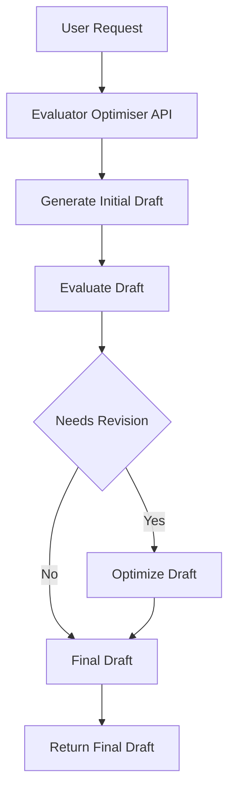

# Evaluator Optimiser

Evaluator Optimiser is a sophisticated workflow application designed to iteratively refine and optimize textual drafts using AI models. It leverages a combination of large and small language models to generate, evaluate, and enhance text based on feedback.

## Table of Contents
- [Overview](#overview)
- [Usage](#usage)
- [Architecture](#architecture)

## Overview
The Evaluator Optimiser project is built to automate the process of drafting, evaluating, and optimizing text. It uses a workflow pattern that involves generating an initial draft, evaluating it for improvements, and then optimizing the draft based on feedback. This process is facilitated by AI models, specifically the Llama models, to ensure high-quality output.

## Usage
To start the project locally, you can use the following npm scripts:

- **deploy**: Deploy the application using `wrangler deploy`.
- **dev**: Start the development server with `wrangler dev`.
- **lint**: Run linting on the source files using `biome lint --error-on-warnings ./src`.
- **start**: Alias for starting the development server with `wrangler dev`.
- **test**: Run tests using `vitest --watch=false`.
- **test:ci**: Run tests in CI mode using `vitest --watch=false`.
- **type-check**: Perform TypeScript type checking with `tsc --noEmit`.

### API Interaction
The project exposes a RESTful API with the following endpoints:

#### POST /
Trigger a new workflow instance.
- **Request**: JSON payload with a `prompt` property.
- **Response**: JSON object containing the workflow instance ID and details.
- **Curl Command**:
  ```bash
  curl -X POST http://localhost:8787/ -H "Content-Type: application/json" -d '{"prompt": "Your prompt here"}'
  ```

#### GET /:id
Fetch the status of an existing workflow instance by its ID.
- **Request**: Instance ID as a URL parameter.
- **Response**: JSON object containing the status of the workflow instance.
- **Curl Command**:
  ```bash
  curl http://localhost:8787/{id}
  ```

## Architecture
The Evaluator Optimiser application is structured as a cloud-based workflow system. It uses Cloudflare Workers to manage the execution of tasks and AI models for processing text. The architecture follows the Evaluator-Optimizer pattern, where an initial draft is generated, evaluated, and optimized iteratively.

### System Diagram


### Evaluator-Optimizer Pattern
The project implements the Evaluator-Optimizer pattern, which involves:
- **Initial Draft Generation**: Using a small AI model to create a draft.
- **Draft Evaluation**: Providing feedback on the draft using the same model.
- **Draft Optimization**: If needed, refining the draft using a larger AI model based on feedback.

This pattern ensures that the text is iteratively improved, leveraging AI capabilities to enhance quality and coherence.