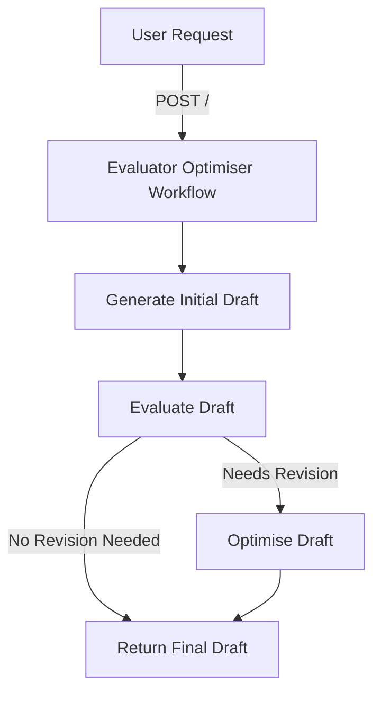
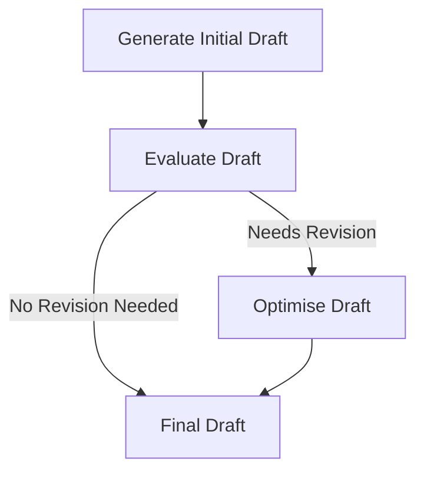

# Evaluator Optimiser

Welcome to the **Evaluator Optimiser** worker! This project is designed to generate an initial text draft, evaluate it, and then optimise it when necessary, all by orchestrating calls to different AI models. If you have tasks that need iterative refinement—first producing a rough draft, then evaluating and optionally improving it—this worker will automate those steps swiftly.

## Table of Contents
1. [Overview](#overview)
2. [Usage](#usage)
3. [Architecture](#architecture)

## Overview
The Evaluator Optimiser is a Cloudflare Worker Workflow that automates the process of generating, evaluating, and optimising text drafts. It uses AI models to perform these tasks asynchronously, ensuring efficient and reliable text refinement. The workflow is encapsulated in a series of steps that include draft generation, evaluation, and optimisation.

## Usage

### Local Development
To run the worker in your local development environment, ensure you have:

- Node.js (LTS version recommended)  
- Yarn or npm  
- `nx` CLI (installed globally or via npx)

Then run:
```bash
npx nx dev evaluator-optimiser
```
By default, `wrangler dev` will be invoked under the hood. Your worker will be accessible at a local development endpoint (typically `localhost:<port>`).

### Environment Variables
- The file `.dev.vars` contains environment variables for development. For instance:
  ```bash
  OPENAI_API_KEY=sk-proj-RdrexlMjH-JdjL6an...
  ```
  Replace the placeholder with your actual OpenAI API key, taking care never to commit real credentials to version control.

- The `wrangler.jsonc` file configures your worker for Cloudflare. Within it, various environments (development, staging, production) define different variable sets. By default, `ENVIRONMENT` is set to `production`, but it can be overridden in each environment configuration.

### Deployments
The `package.json` scripts include:

- `deploy:production` — Deploys the production environment:
  ```bash
  yarn deploy:production
  ```
  or
  ```bash
  npm run deploy:production
  ```
- `deploy:staging` — Deploys the staging environment:
  ```bash
  yarn deploy:staging
  ```
  or
  ```bash
  npm run deploy:staging
  ```

Adjust them according to your preferred package manager. Deployment uses [Wrangler](https://developers.cloudflare.com/workers/wrangler) behind the scenes.

### API Endpoints
- **`POST /`**  
  Triggers a new workflow instance.  
  **Request body** should be JSON, including:
  ```json
  { "prompt": "Your task description or request here" }
  ```
  **Example response**:
  ```json
  {
    "id": "<workflow-instance-id>",
    "details": {
      "status": "running or completed",
      ...
    }
  }
  ```
- **`GET /:id`**  
  Fetches the status of an existing workflow instance by its ID.  
  **Example response**:
  ```json
  {
    "status": {
      "result": {
        "initialDraft": "Initial draft",
        "evaluation": {
          "feedback": "Constructive feedback",
          "needsRevision": false
        },
        "finalDraft": "Possibly an improved version"
      },
      ...
    }
  }
  ```

## Architecture

### System Diagram


### Evaluator-Optimizer Pattern
The Evaluator Optimiser employs the Evaluator-Optimizer pattern, which involves an iterative refinement loop between task execution and evaluation. This pattern is beneficial for tasks that require iterative, criteria-based improvement, such as text generation and refinement.



## Conclusion

**Evaluator Optimiser** is a compact yet powerful Cloudflare Worker Workflow that harnesses multiple AI models to produce, evaluate, and enhance text content. Whether you need quick, iterative text generation or a more extensive review of complex tasks, this service delivers a streamlined approach to text refinement.

Should you have any questions or suggestions, please open an issue or submit a pull request. Enjoy your refined, AI-driven text outputs!