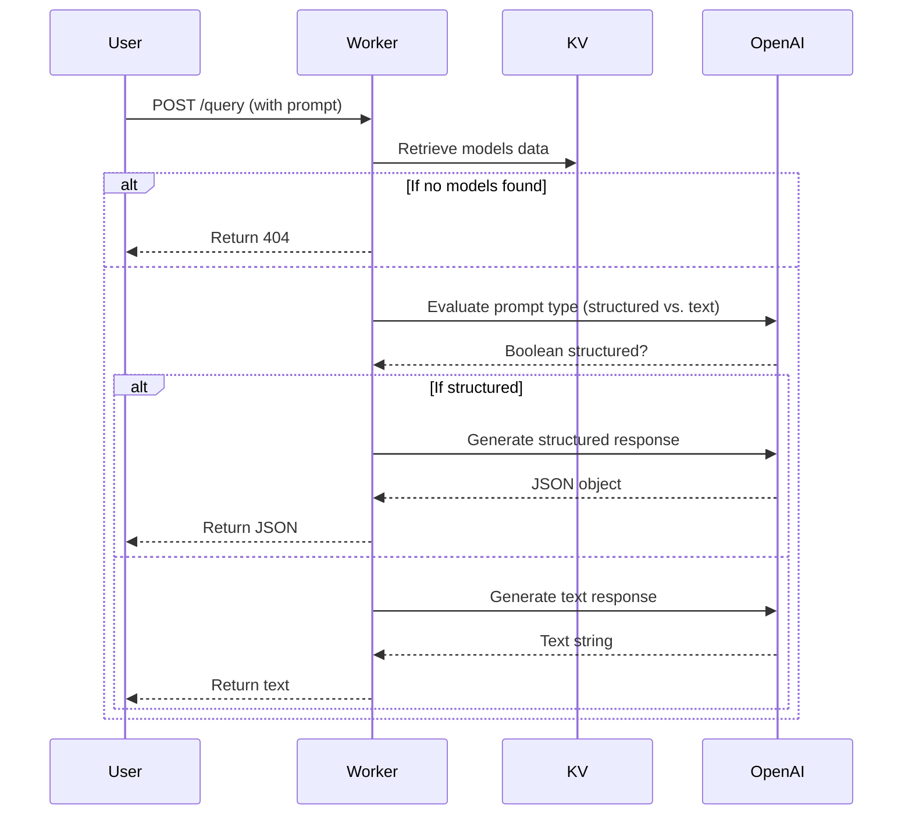

# Model Scraper

A joyful worker that fetches model definitions from a GitHub repository, tucks them into Cloudflare KV for safekeeping, and intelligently serves them up via simple HTTP endpoints. This worker uses Cloudflare’s latest AI integration features to determine whether your prompts require structured or text-based responses.

## Table of Contents

1. [Overview](#overview)
2. [Usage](#usage)
   - [Development Mode](#development-mode)
   - [Staging Deployment](#staging-deployment)
   - [Production Deployment](#production-deployment)
3. [API Endpoints](#api-endpoints)
   - [POST /update](#post-update)
   - [POST /query](#post-query)
   - [GET /models_by_task](#get-models_by_task)
   - [GET /models_by_capability](#get-models_by_capability)
4. [Environment Variables](#environment-variables)
5. [Interesting Patterns](#interesting-patterns)
6. [Testing & Linting](#testing--linting)

## Overview

**Model Scraper** is a Cloudflare Worker (written in TypeScript) that does the following:

1. **Fetch** JSON models from a GitHub repository.
2. **Save** these models to a Cloudflare KV store.
3. **Serve** them using a handful of endpoints that allow queries and filtering by attributes such as task ID or specific capabilities.

The worker leverages an AI interface to decide whether to respond with structured JSON or a text-based response, based on the prompt given by the user. This is particularly helpful if you’re building an application that needs advanced AI-driven responses without losing the convenience of RESTful endpoints.

## Usage

You can run this worker in development mode or deploy it to staging or production. The following commands assume you have [Nx](https://nx.dev/) and the appropriate Cloudflare [Wrangler](https://developers.cloudflare.com/workers/wrangler/) tooling configured.

### Development Mode

1. Make sure you have your environment variables set in `apps/model-scraper/.dev.vars` (see [Environment Variables](#environment-variables) below).
2. Then simply run:

   ```bash
   npx nx dev model-scraper
   ```

This will start the worker in development mode, using the `.dev.vars` file to load your `GITHUB_TOKEN` and `OPENAI_API_KEY`.

### Staging Deployment

Deploying to staging uses a separate environment within `wrangler.jsonc`:

```bash
npx nx run model-scraper:deploy:staging
```

### Production Deployment

Similarly, for production:

```bash
npx nx run model-scraper:deploy:production
```

## API Endpoints

All endpoints are defined in [`src/index.ts`](./src/index.ts). Below is a summary of each route and what it does.

### POST `/update`

- **Description**: Fetches JSON files from the designated GitHub repository and stores them in the KV namespace (`JSON_DATA`).
- **How to Use**:
  ```bash
  curl -X POST https://<your-worker-url>/update
  ```

### POST `/query`

- **Description**: Accepts a JSON body containing `prompt`. It checks the prompt to decide if the response should be structured JSON or plain text. It then uses the data in KV to provide the best possible answer.
- **Body**:
  ```json
  {
    "prompt": "Tell me about GPT-based models."
  }
  ```
- **How to Use**:
  ```bash
  curl -X POST \
       -H "Content-Type: application/json" \
       -d '{"prompt": "Give me all the GPT models."}' \
       https://<your-worker-url>/query
  ```

### GET `/models_by_task?task=...`

- **Description**: Filters and returns an array of models whose `task.id` matches the provided `task` query parameter.
- **Example**:
  ```bash
  curl "https://<your-worker-url>/models_by_task?task=generation"
  ```

### GET `/models_by_capability?capability=...`

- **Description**: Filters and returns an array of models with certain capabilities. Currently, only the "tools" capability is supported, which checks if a model supports tool-calling.
- **Example**:
  ```bash
  curl "https://<your-worker-url>/models_by_capability?capability=tools"
  ```

## Environment Variables

Within `apps/model-scraper/.dev.vars`, you should provide:

```
GITHUB_TOKEN=ghp_LodfD6qSG...
OPENAI_API_KEY=sk-proj-RdrexlMjH-JdjL6an...
```

Do not commit real tokens to version control. In production and staging, use secure mechanisms (such as Cloudflare Secrets) to store these.

## Interesting Patterns

1. **AI-Based JSON vs. Text**  
   The `/query` endpoint uses a simple AI-based check that determines whether the prompt should be answered with structured JSON or standard text. It accomplishes this by first sending your prompt to a small “evaluation” schema (`criteriaSchema`), then deciding which path to take.

2. **Workflow Pattern with Hono**  
   Hono is used to define routes in a straightforward manner, ensuring each endpoint has clear, separate responsibilities.

### Mermaid Diagram

Below is a simplified depiction of how the worker processes a request for the `/query` endpoint:



## Testing & Linting

- **Unit Tests**:  
  Run the test suite (powered by [Vitest](https://vitest.dev/)) with:
  ```bash
  npx nx run model-scraper:test
  ```
  or
  ```bash
  npm run test
  ```
  (in the `apps/model-scraper` directory).

- **Linting**:  
  A simple lint check with Biome:
  ```bash
  npx nx run model-scraper:lint
  ```
  or
  ```bash
  npm run lint
  ```

- **Type Checking**:
  ```bash
  npx nx run model-scraper:type-check
  ```
  This ensures your code is free from TypeScript errors.