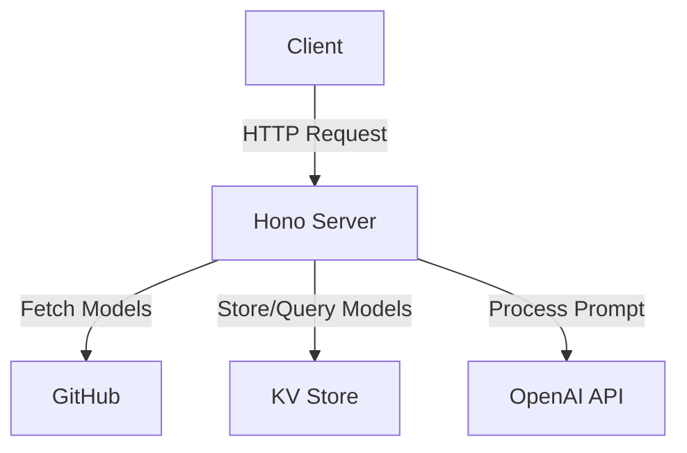
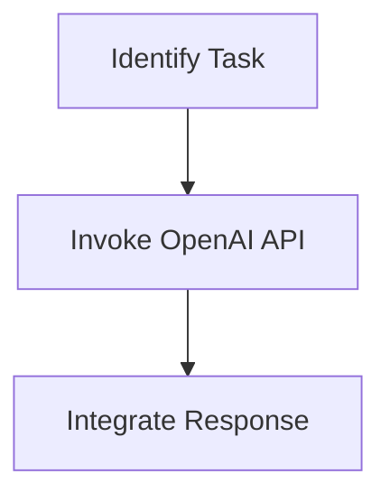
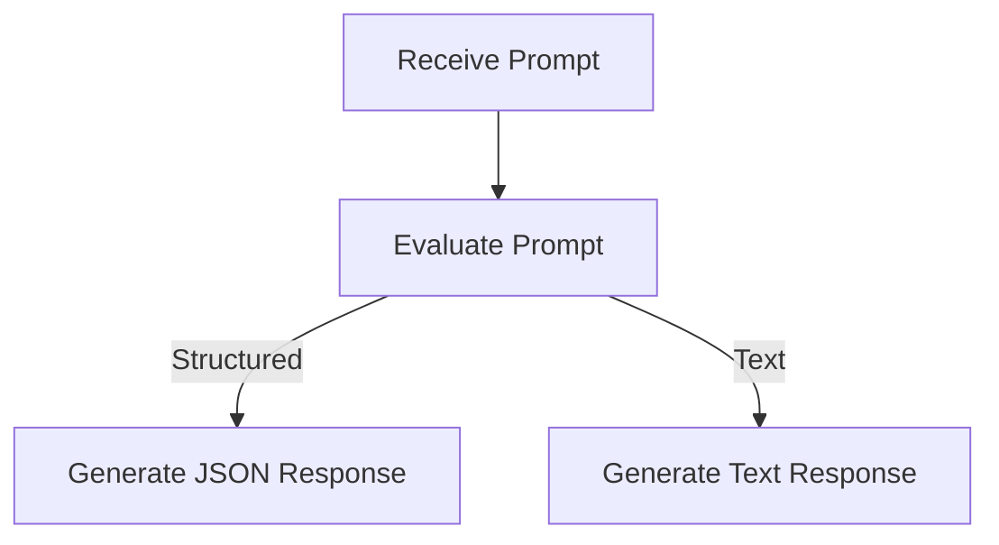

# Model Scraper

Model Scraper is a cloud-based application designed to fetch, store, and query AI model data from GitHub. It provides an API for interacting with the model data, allowing users to update, query, and filter models based on specific tasks or capabilities.

## Table of Contents
- [Overview](#overview)
- [Usage](#usage)
- [Architecture](#architecture)

## Overview
Model Scraper's primary purpose is to manage AI model data by fetching it from a GitHub repository and storing it in a KV store. The application exposes several API endpoints to interact with this data, enabling users to update the model data, query it based on prompts, and filter models by task or capability. The architecture is built using the Hono framework and integrates with OpenAI's API for processing prompts.

## Usage
To start the project locally, use the following command:
```
npx nx start model-scraper
```

### NPM Scripts
- **deploy:production**: Deploys the application to the production environment using Wrangler.
- **deploy:staging**: Deploys the application to the staging environment using Wrangler.
- **dev**: Starts the application in development mode with remote access.
- **lint**: Lints the source code using Biome, reporting errors on warnings.
- **start**: Starts the application in development mode.
- **test**: Runs the test suite using Vitest without watching for changes.
- **test:ci**: Runs the test suite in continuous integration mode.
- **type-check**: Performs TypeScript type checking without emitting files.

### API Endpoints
- **POST /update**: Fetches the model map from GitHub and saves it into the KV store.
  - **Request**: No body required.
  - **Response**: `{ "success": true }`
  - **Curl**:
    ```bash
    curl -X POST https://your-domain.com/update
    ```

- **POST /query**: Accepts a prompt and returns a response based on the available models data.
  - **Request**:
    ```json
    {
      "prompt": "Your prompt here"
    }
    ```
  - **Response**: JSON object with the response.
  - **Curl**:
    ```bash
    curl -X POST -H "Content-Type: application/json" -d '{"prompt": "Your prompt here"}' https://your-domain.com/query
    ```

- **GET /models_by_task?task=...**: Returns an array of models whose task.id matches the provided task parameter.
  - **Request**: Query parameter `task` is required.
  - **Response**: Array of models.
  - **Curl**:
    ```bash
    curl https://your-domain.com/models_by_task?task=your-task-id
    ```

- **GET /models_by_capability?capability=...**: Returns models that support tool calling.
  - **Request**: Query parameter `capability` is required.
  - **Response**: Array of models.
  - **Curl**:
    ```bash
    curl https://your-domain.com/models_by_capability?capability=tools
    ```

## Architecture
Model Scraper is an application that uses the Hono framework to handle HTTP requests and integrates with OpenAI's API for processing prompts. The system architecture includes components for fetching model data from GitHub, storing it in a KV store, and providing an API for querying and filtering this data.

### System Diagram


### Agentic Patterns
Model Scraper uses the following agentic design patterns:

#### Tool Use Pattern
The application dynamically interacts with external tools or APIs, specifically the OpenAI API, to process prompts and generate responses.



#### Routing
The application classifies inputs (prompts) to determine whether they should be processed as structured JSON responses or text-based responses.

