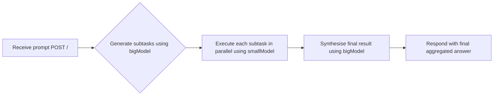

# Orchestrator Workers

Welcome to **Orchestrator Workers**! This project is a Cloudflare Workers-based orchestrator designed to break down complex coding tasks into manageable subtasks, distribute them among specialised "worker" AI models, and then synthesise the final result into a comprehensive solution.

## Table of Contents
1. [Overview](#overview)
2. [Usage](#usage)
3. [Architecture](#architecture)

## Overview
The Orchestrator Workers project aims to efficiently handle complex coding tasks by leveraging a workflow orchestration pattern. It uses a large language model to decompose tasks into subtasks, executes these subtasks in parallel using smaller models, and aggregates the results into a final solution. This approach ensures both efficiency and high-quality output.

## Usage
To start the project locally, run the following command:

```bash
npx nx dev orchestrator-workers
```

This command starts a local server using `wrangler dev`, accessible at `http://127.0.0.1:8787`.

### API Endpoints
- **POST** `/` - Create a new workflow instance by sending a JSON payload with a `prompt` property.
- **GET** `/:id` - Retrieve the status of an existing workflow instance by its ID.

#### Example API Calls

**Create a New Workflow Instance**

```bash
curl -X POST http://127.0.0.1:8787/ \
     -H "Content-Type: application/json" \
     -d '{"prompt":"Build a TypeScript project with multiple steps..."}'
```

**Check the Status of an Existing Workflow Instance**

```bash
curl -X GET http://127.0.0.1:8787/<workflow-instance-id>
```

## Architecture
The architecture of Orchestrator Workers is based on a multi-step orchestration pattern combined with parallelised subtask execution. The main components include:

1. **High-Level Planning** - A large model identifies the subtasks required to solve the user-provided prompt.
2. **Specialised Execution** - Each subtask is executed by a more specialised (and faster) model in parallel.
3. **Aggregated Synthesis** - The large model merges these partial solutions into a single, comprehensive answer.

### Workflow Diagram


This project showcases the **Orchestrator-Workers** pattern, where a central orchestrating LLM dynamically assigns subtasks to worker LLMs, ensuring efficient task decomposition and execution.