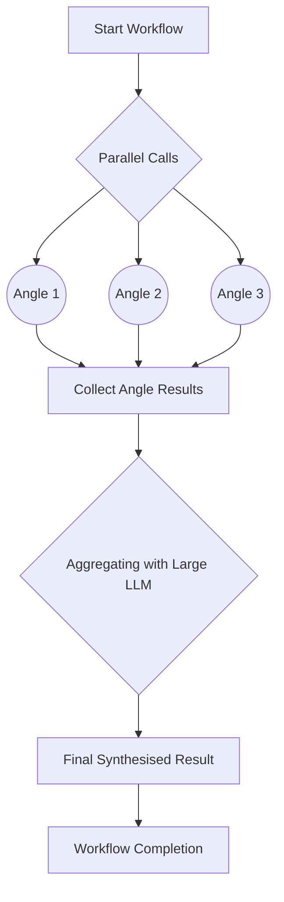

# Parallelisation Worker

Welcome to the **Parallelisation Worker**! This worker orchestrates a workflow that processes text prompts in parallel, then aggregates the resulting outputs to form a comprehensive, synthesised conclusion. Below you will find a thorough explanation of how it works, how to deploy and test it, and a high-level diagram illustrating the worker’s internal workflow.

---

## Overview

This worker leverages Cloudflare Workflows and a combination of **small** and **large** language models to process a single user prompt from multiple perspectives. These perspectives are then aggregated to produce one definitive, synthesised result. In particular, it:

1. Splits the input prompt into multiple “angles” or perspectives.
2. Processes each “angle” in parallel using small LLMs.
3. Aggregates these parallel outputs with a larger LLM, producing a final combined response.

The worker exposes two primary HTTP endpoints:

- **POST `/`**: Creates a new workflow instance with a given prompt.
- **GET `/:id`**: Retrieves the status of a previously created workflow instance by its ID.

---

## Running the Project

### Development

1. **Install dependencies** (at the root of your monorepo or wherever the package is located):
   ```bash
   npm install
   ```

2. **Start the development server** for the Parallelisation Worker:
   ```bash
   npx nx dev parallelisation
   ```
   This will run `wrangler dev -e development` under the hood, as defined in the worker’s `package.json`.

### Additional Commands

- **Deploy to Production**:
  ```bash
  npx nx deploy:production parallelisation
  ```
- **Deploy to Staging**:
  ```bash
  npx nx deploy:staging parallelisation
  ```
- **Run Tests**:
  ```bash
  npx nx test parallelisation
  ```
- **Lint the Code**:
  ```bash
  npx nx lint parallelisation
  ```
- **Type Check**:
  ```bash
  npx nx type-check parallelisation
  ```

---

## File Structure

Below is a brief overview of the main files in this application:

- **`wrangler.jsonc`**  
  The configuration for the worker, specifying the worker name, entry point, environment variables, and workflow bindings.

- **`package.json`**  
  Contains scripts for development, testing, and deployment.

- **`vitest.config.ts`**  
  Configures Vitest to run tests (currently allows no tests to pass gracefully).

- **`src/types/hono.ts`** and **`src/types/env.ts`**  
  Define TypeScript types for the application context and environment bindings.

- **`src/parallelisation-workflow.ts`**  
  Houses the `ParallelisationWorkflow` class, orchestrating parallel calls to multiple language models and then aggregating results.

- **`src/index.ts`**  
  The main entry point for the Hono-based HTTP server. Exposes endpoints for initiating and tracking workflow instances.

---

## Usage

### 1. Create a Workflow Instance

Send a `POST` request to the worker’s root endpoint (`/`) with a JSON body containing your `prompt`:

```bash
curl -X POST \
     -H "Content-Type: application/json" \
     -d '{"prompt":"Explain the concept of concurrency"}' \
     http://localhost:8787
```

This will create a new workflow instance and return an ID you can use to check its status.

Example response:
```json
{
  "id": "clldfeoq70023y5r3rc5u5ryz",
  "details": {
    "status": "QUEUED",
    "result": null,
    "error": null
  }
}
```

### 2. Check a Workflow’s Status

Once you have the workflow instance ID, you can fetch its status:

```bash
curl http://localhost:8787/clldfeoq70023y5r3rc5u5ryz
```

---

## Interesting Patterns

This worker demonstrates a clear **parallel-then-aggregate** approach. Below is a Mermaid diagram illustrating the workflow’s internal steps:



1. **Parallel Calls**: The worker simultaneously queries multiple smaller language models, each tasked with analysing the prompt from a different angle.
2. **Aggregation**: A larger model ingests each of the smaller model’s outputs, then combines them into a consolidated, final result.
3. **Completion**: The workflow returns the final combined result along with each individual angle’s output.

---

## Under the Bonnet

1. **Parallel Calls**:
  - Managed by `step.do("parallel angle calls")`, which uses `Promise.all` to invoke three calls concurrently, each to a smaller language model.
2. **Aggregation**:
  - Managed by `step.do("aggregate responses")`, which calls a larger language model to combine and synthesise the three outputs.
3. **WorkflowEntrypoint**:
  - The `ParallelisationWorkflow` class extends `WorkflowEntrypoint`, allowing Cloudflare’s Workflows system to orchestrate individual steps in the process.

---

## Conclusion

This Parallelisation Worker is designed to run quickly in parallel, then rejoin its findings into a single, powerful result. By using multiple language models in combination, it exemplifies a multi-perspective approach to text generation and analysis.

We hope you enjoy using the Parallelisation Worker! If you have any questions or encounter any issues, please feel free to reach out. Happy parallelising!

```
