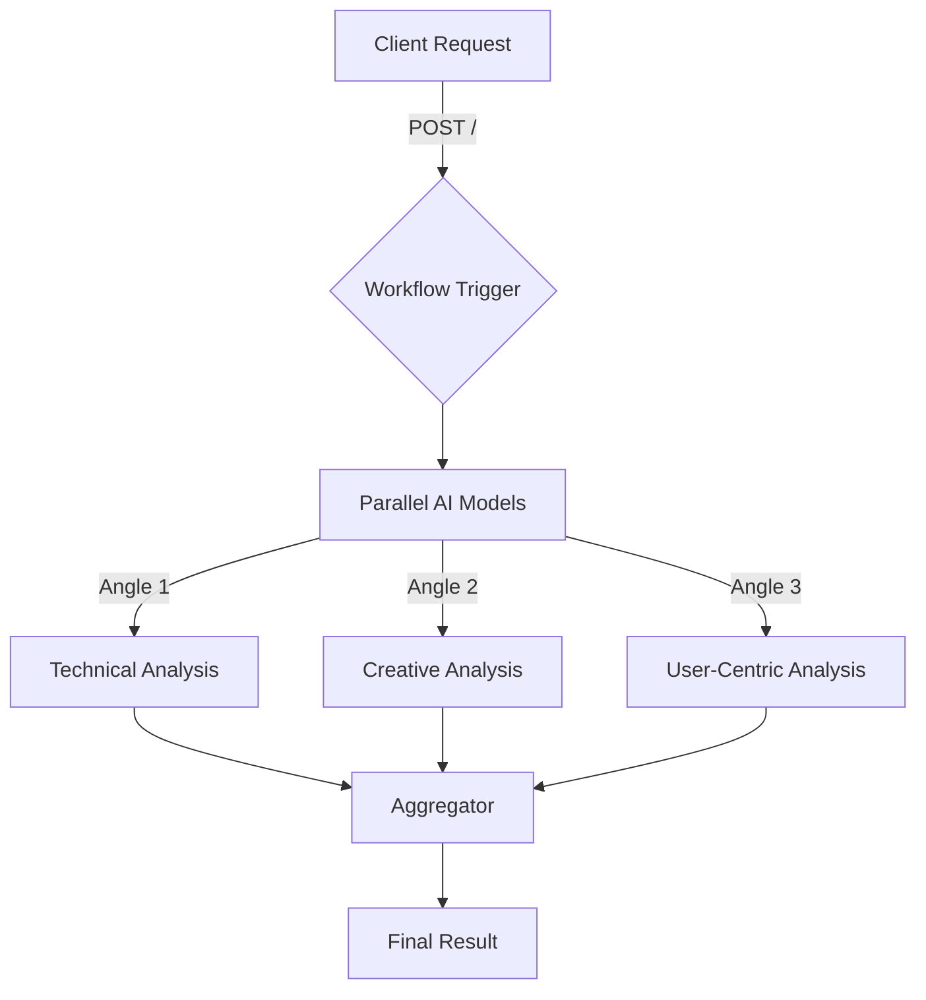
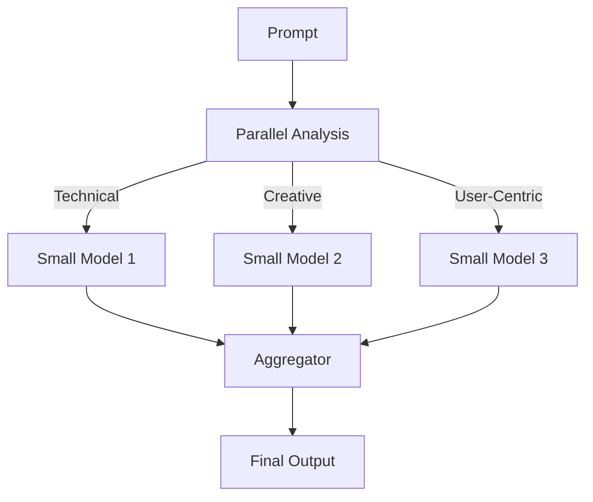

# Parallelisation

Parallelisation is a project designed to execute tasks concurrently using a workflow pattern that leverages AI models for efficient processing. The project is structured to handle multiple perspectives on a given prompt and aggregate these into a comprehensive result.

## Table of Contents
- [Overview](#overview)
- [Usage](#usage)
- [Architecture](#architecture)

## Overview
The Parallelisation project aims to demonstrate the use of parallelisation in AI workflows. It utilizes multiple AI models to analyze a prompt from different perspectives and then aggregates these analyses into a final result. The project is built using Cloudflare Workers and integrates AI models for processing.

## Usage
To start the project locally, use the following command:
```bash
npx nx dev parallelisation
```

### NPM Scripts
- **deploy**: Deploys the application using Wrangler.
  ```bash
  npx nx deploy parallelisation
  ```
- **dev**: Starts the development server using Wrangler.
  ```bash
  npx nx dev parallelisation
  ```
- **lint**: Lints the source code using Biome.
  ```bash
  npx nx lint parallelisation
  ```
- **start**: Alias for `dev`, starts the development server.
  ```bash
  npx nx start parallelisation
  ```
- **test**: Runs the test suite using Vitest.
  ```bash
  npx nx test parallelisation
  ```
- **test:ci**: Runs the test suite in CI mode using Vitest.
  ```bash
  npx nx test:ci parallelisation
  ```
- **type-check**: Performs TypeScript type checking.
  ```bash
  npx nx type-check parallelisation
  ```

### API Endpoints
#### POST /
- **Description**: Triggers a new workflow instance.
- **Request Format**: JSON with a `prompt` property.
- **Response Format**: JSON with `id` and `details` of the workflow instance.
- **Curl Command**:
  ```bash
  curl -X POST http://localhost:8787/ -H "Content-Type: application/json" -d '{"prompt": "Your prompt here"}'
  ```

#### GET /:id
- **Description**: Fetches the status of an existing workflow instance by its ID.
- **Response Format**: JSON with the `status` of the workflow instance.
- **Curl Command**:
  ```bash
  curl http://localhost:8787/{id}
  ```

## Architecture
The project follows a parallelisation workflow pattern, utilizing multiple AI models to process tasks concurrently. The architecture is designed to handle tasks in parallel and aggregate results efficiently.

### System Diagram


### Parallelisation Pattern
The project employs the Parallelisation pattern, specifically the Voting variation, where multiple AI models analyze a prompt from different perspectives simultaneously. The results are then aggregated to form a comprehensive response.

