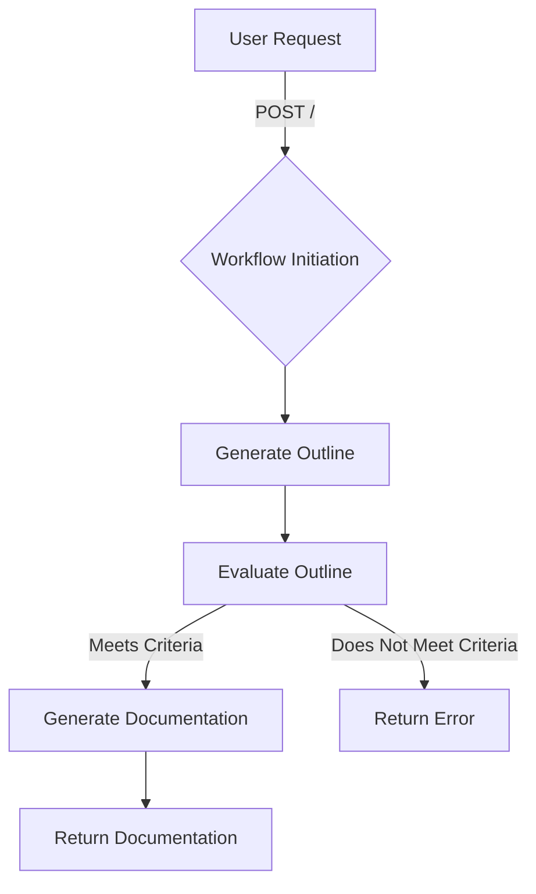

# Prompt Chaining

Prompt Chaining is a workflow application designed to automate the generation of technical documentation through a series of predefined steps. It leverages AI models to create, evaluate, and finalize documentation outlines, ensuring they meet specified criteria before generating the full documentation.

## Table of Contents
1. [Overview](#overview)
2. [Usage](#usage)
3. [Architecture](#architecture)

## Overview
The Prompt Chaining project is designed to streamline the process of generating technical documentation. It uses a workflow that involves generating an outline, evaluating it against criteria, and then producing the full documentation. The application is built using Cloudflare Workers and integrates AI models to perform these tasks efficiently.

## Usage
To start the project locally, use the following command:
```bash
npx nx dev prompt-chaining
```

### API Endpoints
- **POST /**: Initiates a new workflow instance. Expects a JSON payload with a `prompt` property.
  - **Request**:
    ```json
    {
      "prompt": "Your technical documentation prompt here"
    }
    ```
  - **Response**:
    ```json
    {
      "id": "instance-id",
      "details": "status-details"
    }
    ```
  - **Curl Command**:
    ```bash
    curl -X POST http://localhost:8787/ -H "Content-Type: application/json" -d '{"prompt": "Your technical documentation prompt here"}'
    ```

- **GET /:id**: Fetches the status of an existing workflow instance by ID.
  - **Response**:
    ```json
    {
      "status": "current-status"
    }
    ```
  - **Curl Command**:
    ```bash
    curl http://localhost:8787/{id}
    ```

### NPM Scripts
- **deploy**: Deploys the application using Wrangler.
- **dev**: Starts the development server using Wrangler.
- **lint**: Lints the source code using Biome.
- **start**: Alias for `dev`, starts the development server.
- **test**: Runs tests using Vitest.
- **test:ci**: Runs tests in CI mode using Vitest.
- **type-check**: Performs TypeScript type checking.

## Architecture
The architecture of the Prompt Chaining application is centered around a workflow that automates the generation of technical documentation. It uses Cloudflare Workers to handle HTTP requests and manage workflow instances.

### System Diagram


### Workflow Pattern: Prompt Chaining
The project implements the Prompt Chaining workflow pattern, where tasks are decomposed into sequential steps:
1. **Generate Outline**: Create a detailed outline for the documentation.
2. **Evaluate Outline**: Check if the outline meets the specified criteria.
3. **Generate Documentation**: Produce the full documentation based on the approved outline.

This pattern ensures that each step is completed successfully before proceeding to the next, maintaining a high standard of quality for the generated documentation.