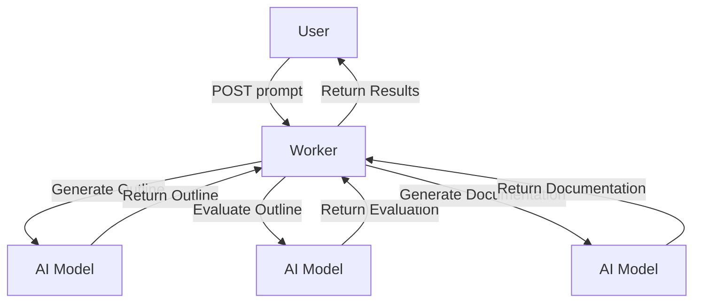

# Prompt Chaining

**Welcome to the Prompt Chaining worker!** This Cloudflare Worker orchestrates a multi-step AI-driven workflow, prompting a large language model to generate a technical documentation outline, evaluating that outline against certain criteria, and then producing full documentation if it meets the criteria. This README provides an overview of what the worker does, how to run and deploy it, and how you can interact with it.

## Table of Contents
1. [Overview](#overview)
2. [Usage](#usage)
3. [Architecture](#architecture)
4. [Workflow Patterns](#workflow-patterns)
5. [Interesting Implementation Details](#interesting-implementation-details)
6. [File-by-File Overview](#file-by-file-overview)
7. [Testing](#testing)
8. [Conclusion](#conclusion)

## Overview
The Prompt Chaining worker is designed to automate the creation of technical documentation through a structured workflow. It leverages Cloudflare's AI capabilities to generate, evaluate, and finalize documentation based on user-provided prompts. The worker operates by receiving a prompt, generating an outline, evaluating the outline, and then producing full documentation if the criteria are met.

## Usage
To start a local development server using [`wrangler`](https://developers.cloudflare.com/workers/wrangler) and Nx, run:

```bash
npx nx dev prompt-chaining
```

This command:
- Bundles and serves the worker locally on your machine.
- Watches source files for changes.
- Provides a convenient way to test and iterate on the worker.

### Environment Modes
The worker can run in development, staging, or production modes. This is controlled by the `ENVIRONMENT` variable:
- `development`
- `staging`
- `production`

These modes are set in `wrangler.jsonc`. For example, when you run `npx nx dev prompt-chaining`, you will be using the development environment configuration.

### Deployment
This project uses `wrangler` under the hood for deployment. The following scripts are available in `package.json`:

- **Deploy to Production**
  ```bash
  npx nx deploy:production prompt-chaining
  ```

- **Deploy to Staging**
  ```bash
  npx nx deploy:staging prompt-chaining
  ```

### Usage Examples
1. **Trigger a New Workflow**

   ```bash
   curl -X POST "http://localhost:8787/" \
     -H "Content-Type: application/json" \
     -d '{"prompt": "I need documentation for a new authentication microservice."}'
   ```

  - This will return a JSON object containing an `id` (the workflow instance ID) and `details` (the current workflow status).

2. **Retrieve Workflow Status**

   ```bash
   curl -X GET "http://localhost:8787/<WORKFLOW_INSTANCE_ID>"
   ```

  - Replace `<WORKFLOW_INSTANCE_ID>` with the ID you received when triggering the workflow. This returns the status and any generated results or error messages.

## Architecture
The architecture of the Prompt Chaining worker is based on a multi-step workflow pattern, utilizing Cloudflare's AI integrations to automate documentation generation. Below is a Mermaid diagram illustrating the system architecture:



## Workflow Patterns
Internally, the worker orchestrates a multi-step “prompt chaining” workflow using Cloudflare’s built-in AI integration. Below is a Mermaid diagram illustrating how the workflow proceeds after the user sends a prompt:


## Interesting Implementation Details
- **Workers AI**  
  We use [`createWorkersAI`](https://developers.cloudflare.com/workers/ai/) to interact with Cloudflare’s AI, sending prompts and receiving structured responses.

- **Zod for Schema Validation**  
  The code uses [Zod](https://zod.dev/) to define schemas (`outlineSchema`, `criteriaSchema`, `documentationSchema`) that the AI-generated responses must conform to.

- **Workflow-First Approach**  
  Each logical step (`generate outline`, `evaluate outline`, `generate documentation`) is called using `step.do(...)`, making it straightforward to trace the workflow and debug issues.

## File-by-File Overview
1. **`.dev.vars`**  
   Holds local development variables (not committed to source control). Useful for local environment customisation.

2. **`wrangler.jsonc`**  
  - Specifies global and environment-specific settings (development, staging, production).
  - Defines the name, entry point (`main`), AI binding (`AI`), and the workflow binding (`PROMPT_CHAINING_WORKFLOW`).

3. **`package.json`**  
  - Houses the scripts for deploying, developing, linting, testing, and performing type checks.
  - Notable scripts: `dev`, `deploy:production`, `deploy:staging`.

4. **`vitest.config.ts`**  
  - Configures [Vitest](https://vitest.dev/) tests, here set to pass even if no tests exist.

5. **`src/types/hono.ts` & `src/types/env.ts`**  
  - Declares TypeScript types for the Hono framework and environment bindings.
  - Ensures type safety when referencing the environment (e.g., `ENVIRONMENT`, `AI`).

6. **`src/index.ts`**  
  - Defines Hono-based routes:
    - `POST /` to create a new workflow instance.
    - `GET /:id` to fetch a workflow’s status by ID.
  - Uses Cross-Origin Resource Sharing (CORS) middleware for broader client compatibility.

7. **`src/prompt-chaining-workflow.ts`**  
  - The core logic of the workflow.
  - Defines three key steps (generate outline, evaluate outline, and generate documentation).
  - Employs `generateObject` from the AI library to structure the AI responses according to Zod schemas.

## Testing
From within this project:

```bash
npm test
```

or, for CI environments,

```bash
npm run test:ci
```

These commands will execute your test suite in a headless, watch-disabled mode.

## Conclusion
The Prompt Chaining worker demonstrates a dynamic, multi-step approach to generating and validating content using Cloudflare’s AI workflows. By chaining prompts, you can inject iterative logic into your content generation, enabling more sophisticated interactions and higher-quality results.

**Give it a try:** fire up the development server, POST a prompt, and observe how the workflow iterates through the steps to produce meticulously evaluated documentation. If you have any questions or run into issues, please consult the source files or open an issue with your observations.

Happy chaining!