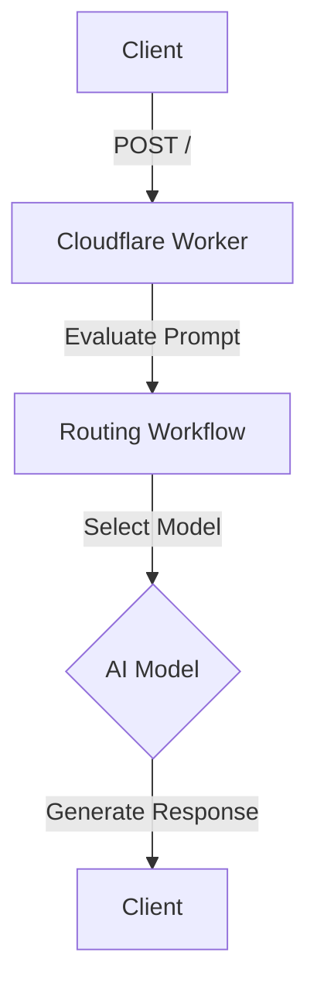
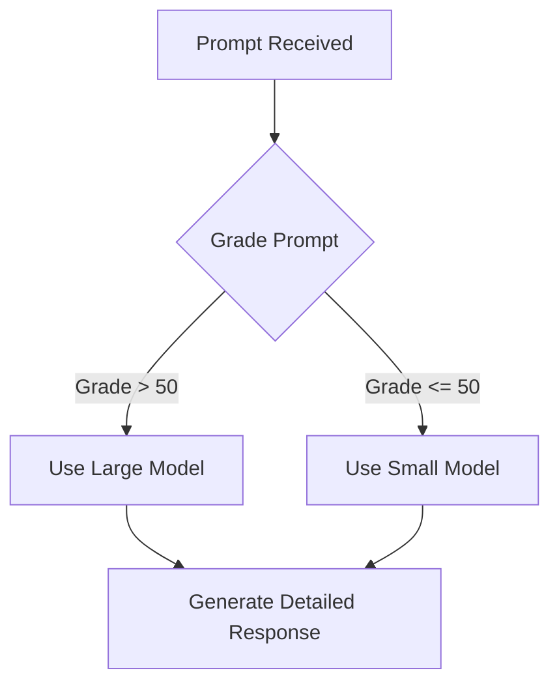

# Routing

This project is a cloud-based application designed to handle routing workflows using AI models. It evaluates prompts based on complexity and generates detailed responses using appropriate AI models.

## Table of Contents
- [Overview](#overview)
- [Usage](#usage)
- [Architecture](#architecture)

## Overview
The Routing project is designed to process and evaluate prompts using AI models. It uses a workflow to grade the complexity of a prompt and then generates a detailed response. The project leverages Cloudflare Workers and AI models to perform these tasks efficiently.

## Usage
To start the project locally, use the following command:
```
npx nx dev routing
```

### NPM Scripts
- **deploy**: Deploys the application using Wrangler.
  ```
npx nx deploy routing
  ```
- **dev**: Starts the development server using Wrangler.
  ```
npx nx dev routing
  ```
- **lint**: Lints the source code using Biome.
  ```
npx nx lint routing
  ```
- **start**: Alias for `dev`, starts the development server.
  ```
npx nx start routing
  ```
- **test**: Runs the test suite using Vitest.
  ```
npx nx test routing
  ```
- **test:ci**: Runs the test suite in CI mode using Vitest.
  ```
npx nx test:ci routing
  ```
- **type-check**: Performs TypeScript type checking.
  ```
npx nx type-check routing
  ```

### API Endpoints
- **POST /**: Creates a new routing workflow instance.
  - **Request**: JSON object with a `prompt` string.
  - **Response**: JSON object with `id` and `details`.
  - **Curl Command**:
    ```
    curl -X POST http://localhost:8787/ -H "Content-Type: application/json" -d '{"prompt": "Your prompt here"}'
    ```

- **GET /:id**: Retrieves the status of a routing workflow instance.
  - **Request**: Instance ID as a URL parameter.
  - **Response**: JSON object with `status`.
  - **Curl Command**:
    ```
    curl http://localhost:8787/{id}
    ```

## Architecture
The project is structured as a cloud-based application using Cloudflare Workers. It employs a routing workflow to process prompts and generate responses. The workflow uses two AI models, selecting the appropriate one based on the complexity of the prompt.

### System Diagram


### Workflow Pattern: Routing
The project uses a routing workflow pattern to classify prompts and direct them to the appropriate AI model for processing. This ensures that complex prompts are handled by more capable models, while simpler prompts are processed efficiently by smaller models.

