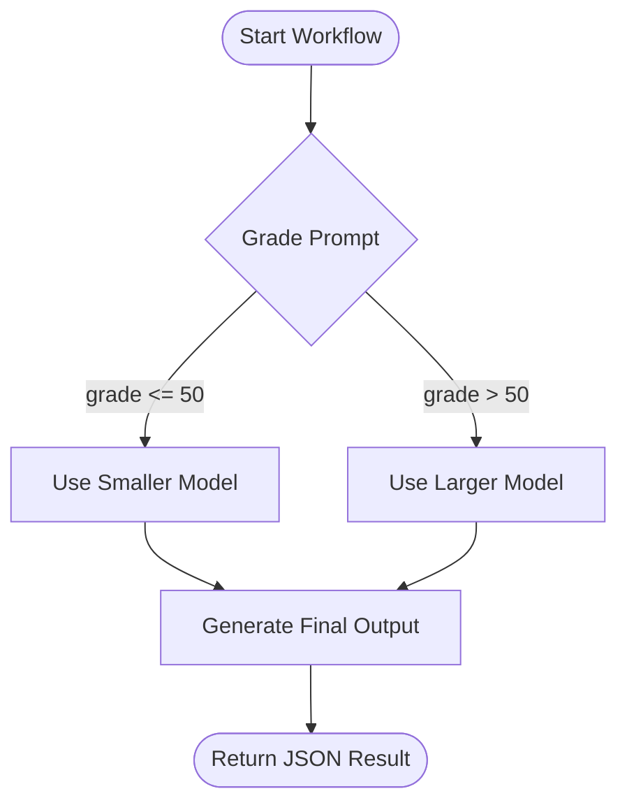

# Routing Worker

Welcome to the **Routing Worker**, your friendly orchestrator for dynamic prompt processing. This Worker harnesses Cloudflare’s new **Workflows** feature to evaluate prompts, choose an appropriate AI model based on complexity, and generate a detailed response. Best of all, you can easily spin it up and continue iterating with `npx nx dev prompt-chaining`. Keep reading to learn how it works, how to run it, and how to get the most out of it.

---

## What Does It Do?

1. **Receives a Prompt:** The Worker accepts an input string (the prompt) via a simple HTTP `POST`.
2. **Grades the Prompt:** It uses a smaller model (e.g. `@cf/meta/llama-3.1-8b-instruct`) to inspect the prompt, assigning a complexity grade from 0 to 100.
3. **Chooses the Appropriate Model:** If the prompt’s grade is over 50, a larger model (e.g. `@cf/meta/llama-3.3-70b-instruct-fp8-fast`) is used for more thorough output. Otherwise, it sticks to the smaller model.
4. **Generates a Final Response:** A second step produces the final, structured result as JSON.

In essence, the Worker acts as a “router” for AI interactions—handing your prompt to the best-suited model. It’s a clear demonstration of Cloudflare Workflows in action, switching seamlessly between AI models in a chain of tasks.

---

## How to Run It

We recommend running it locally for development purposes. From the repository root, simply run:

```bash
npx nx dev routing
```

This command will start the Worker in development mode. Under the hood, it uses `wrangler dev -e development` with the correct project settings.

### Production or Staging Deploys

For production or staging environments, use the dedicated npm scripts within the `apps/routing/package.json`:

```bash
# Deploy to production
npx nx deploy:production routing

# Deploy to staging
npx nx deploy:staging routing
```

---

## How to Use It

1. **Start the Worker** using the command above.
2. **Send a Prompt** with an HTTP `POST` request to the Worker’s root endpoint (`/`), passing JSON with a `prompt` key:
   ```bash
   curl -X POST "http://localhost:8787/" \
   -H "Content-Type: application/json" \
   -d '{"prompt": "Tell me more about quantum entanglement."}'
   ```
   You will receive a JSON response containing an instance `id` and the initial status.

3. **Retrieve Status** by issuing a `GET` request to `/:id`, where `:id` is the instance ID from the previous step:
   ```bash
   curl "http://localhost:8787/your-instance-id"
   ```
   You will get the current status, including the final output once it is ready.

---

## Behind the Scenes

This Worker uses **Workflows** from Cloudflare’s platform (`cloudflare:workers`). Its main logic resides in the [`routing-workflow.ts`](./src/routing-workflow.ts) file. The workflow includes two major steps:

1. **Grade the Prompt**: Uses a smaller language model to assess complexity (`0–100`).
2. **Generate Final Output**: Selects a large or small language model based on the prompt’s grade, then returns a JSON response.

Below is a Mermaid diagram illustrating the process flow:



---

## Interesting Patterns and Concepts

1. **Dynamic Model Selection:** We only invoke the larger AI model if the prompt’s complexity score exceeds 50.
2. **Workflow Chaining**: Two-step “chain” that first grades, then uses the result to adjust the subsequent processing stage.
3. **JSON Schema Validation**: Uses `zod` to ensure the responses from the AI are in a well-defined JSON structure.

---

## Configuration Overview

### `wrangler.jsonc`

- **`name`**: Identifies your Cloudflare Worker for different environments (`routing`, `routing-dev`, `routing-staging`).
- **`env`**: Separate configuration for development and staging, including environment variable overrides.
- **`workflows`**: Ties our `RoutingWorkflow` class into Cloudflare’s Workflow management.

### `package.json`

- Contains key scripts for deploying (`deploy:production`, `deploy:staging`), development (`dev`, `start`), linting (`lint`), testing (`test`), and type-checking (`type-check`).

### `vitest.config.ts`

- Provides Vitest configuration, allowing you to run or skip tests conveniently.

### `src/` Folder

- **`index.ts`**: Defines the HTTP routes for creating a new workflow instance (`POST /`) and retrieving its status (`GET /:id`).
- **`routing-workflow.ts`**: Core logic for grading prompts and generating final responses.
- **`types/`**: Houses shared TypeScript definitions for our environment, Hono server context, and workflow parameters.

---

## Tips and Tricks

- **Local Testing**: Use `curl` or a tool like Postman or Insomnia to quickly test your Worker endpoints.
- **Logs and Observability**: The `observability` flag in `wrangler.jsonc` is set to `true`, so keep an eye on your Worker logs in the Cloudflare dashboard.
- **Extensibility**: Feel free to add further steps or branching logic within the workflow. For instance, you could incorporate additional AI calls if your grade is **really** high.

---

## Conclusion

The **Routing Worker** presents a straightforward yet powerful demonstration of how to orchestrate AI calls in Cloudflare Workers using Workflows. Whether you want to pass simple or complex prompts, it’s got you covered with dynamic model selection, structured JSON output, and an approachable development process.

Give it a spin with `npx nx dev prompt-chaining`, and let the Worker handle routing for you!
