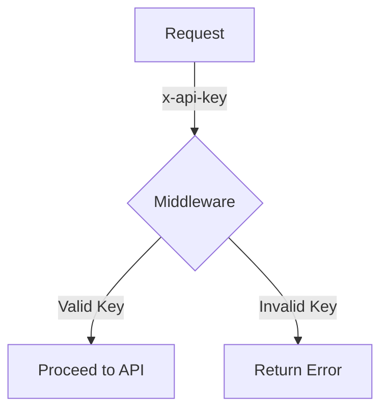

# Routing

The Routing Worker is a Cloudflare Worker that uses Workflows to dynamically process prompts and generate responses. It receives a prompt, grades its complexity, and selects an appropriate AI model to generate a detailed response. The Worker uses a smaller model for simpler prompts and a larger model for more complex ones.

## Table of Contents
- [Overview](#overview)
- [Usage](#usage)
- [Architecture](#architecture)

## Overview
The Routing Worker is designed to efficiently handle and process prompts by dynamically selecting AI models based on the complexity of the input. It leverages Cloudflare Workers and Workflows to manage the routing and processing of requests, ensuring that each prompt is handled by the most suitable AI model. The system supports multiple environments, including development, staging, and production, and uses JSON schema validation to ensure the integrity of responses.

## Usage
To start the project locally, use the following command:
```
npx nx dev routing
```

### NPM Scripts
- **deploy:production**: Deploys the Worker to the production environment using Wrangler.
  ```
npx nx deploy:production routing
  ```
- **deploy:staging**: Deploys the Worker to the staging environment.
  ```
npx nx deploy:staging routing
  ```
- **dev**: Starts the Worker in development mode.
  ```
npx nx dev routing
  ```
- **lint**: Lints the source code and reports errors on warnings.
  ```
npx nx lint routing
  ```
- **start**: Alias for `dev`, starts the Worker in development mode.
  ```
npx nx start routing
  ```
- **test**: Runs the test suite.
  ```
npx nx test routing
  ```
- **test:ci**: Runs the test suite in CI mode.
  ```
npx nx test:ci routing
  ```
- **type-check**: Performs TypeScript type checking.
  ```
npx nx type-check routing
  ```

### API Endpoints
- **POST /**: Accepts a JSON payload with a `prompt` field and returns a response with the processing status.
  - **Request**:
    ```json
    {
      "prompt": "Your prompt here"
    }
    ```
  - **Response**:
    ```json
    {
      "id": "instance-id",
      "details": "status-details"
    }
    ```
  - **Curl Command**:
    ```bash
    curl -X POST https://your-worker-url/ -H "Content-Type: application/json" -d '{"prompt": "Your prompt here"}'
    ```

- **GET /:id**: Retrieves the status of a specific processing instance by ID.
  - **Response**:
    ```json
    {
      "status": "status-details"
    }
    ```
  - **Curl Command**:
    ```bash
    curl https://your-worker-url/{id}
    ```

## Architecture
The architecture of the Routing Worker is designed to efficiently handle prompt processing using a dynamic model selection approach. The system is built on Cloudflare Workers and utilizes the Hono framework for handling HTTP requests. The workflow logic is encapsulated in the `routing-workflow.ts` file, which grades prompts and generates responses using AI models.

### System Diagram


### Agentic Design Patterns
The Routing Worker employs the **Routing** workflow pattern, where inputs are classified to direct tasks into specialized downstream processes. This allows the system to efficiently handle complex tasks by routing them to the appropriate AI model based on the prompt's complexity.