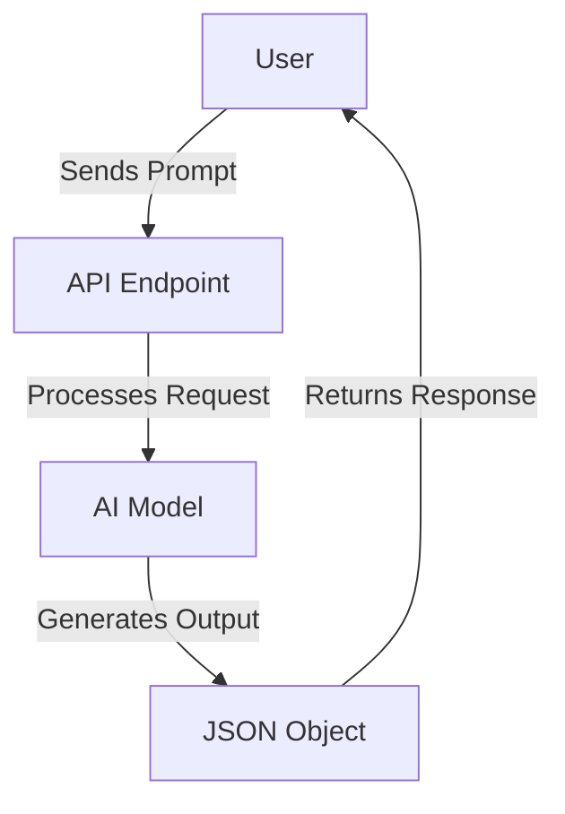

# Structured Output

Structured Output is a web application designed to generate structured data objects from natural language prompts. It leverages AI models to interpret and transform user inputs into predefined JSON structures, making it ideal for applications requiring structured data generation from unstructured text.

## Table of Contents
1. [Overview](#overview)
2. [Usage](#usage)
3. [Architecture](#architecture)

## Overview
Structured Output serves the purpose of converting natural language prompts into structured JSON objects. The application uses AI models to process the input and generate outputs that conform to a specified schema. This functionality is particularly useful in scenarios where structured data is needed from unstructured inputs, such as recipe generation, form filling, and more.

## Usage
To start the project locally, use the following command:

```bash
npx nx dev structured-output
```

### NPM Scripts
- **deploy**: Deploys the application using Wrangler.
  ```bash
  npx nx deploy structured-output
  ```
- **dev**: Starts the development server using Wrangler.
  ```bash
  npx nx dev structured-output
  ```
- **lint**: Lints the source code using Biome.
  ```bash
  npx nx lint structured-output
  ```
- **start**: Alias for `dev`, starts the development server.
  ```bash
  npx nx start structured-output
  ```
- **test**: Runs the test suite using Vitest.
  ```bash
  npx nx test structured-output
  ```
- **test:ci**: Runs the test suite in CI mode.
  ```bash
  npx nx test:ci structured-output
  ```
- **type-check**: Performs TypeScript type checking.
  ```bash
  npx nx type-check structured-output
  ```

### API Interaction
The application exposes an API with the following endpoint:

- **POST /**: Generates a structured JSON object from a given prompt.
  - **Request Format**:
    ```json
    {
      "prompt": "Create a recipe for sourdough bread."
    }
    ```
  - **Response Format**:
    ```json
    {
      "recipe": {
        "name": "Sourdough Bread",
        "ingredients": [
          { "name": "Flour", "amount": "500g" },
          { "name": "Water", "amount": "300ml" }
        ],
        "steps": [
          "Mix ingredients",
          "Let dough rise",
          "Bake in oven"
        ]
      }
    }
    ```
  - **Curl Command**:
    ```bash
    curl -X POST \
    -H "Content-Type: application/json" \
    -d '{"prompt": "Create a recipe for sourdough bread."}' \
    http://localhost:8787/
    ```

## Architecture
Structured Output is built as a serverless application using Cloudflare Workers. The main components include:

- **Hono Framework**: Used for building the API endpoints.
- **Workers AI Provider**: Integrates AI capabilities for processing prompts.
- **Zod**: Utilized for schema validation of the generated JSON objects.

### System Diagram


### Tool Use Pattern
The application employs the Tool Use Pattern by dynamically interacting with AI models to generate structured data. This pattern involves identifying the task, invoking the appropriate AI model, and integrating the returned data into the workflow.

<!-- Last updated: 038947bb9b4fd6d8d05f28479e966cd36b43658e -->