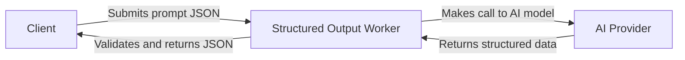

# Structured Output

This project is named **Structured Output** and is a Cloudflare Worker designed to process user prompts and return reliable, structured JSON responses. It leverages an AI model to extract recipe-like data from free-form text, ensuring that each response strictly adheres to a predefined structure.

## Table of Contents
1. [Overview](#overview)
2. [Usage](#usage)
3. [Architecture](#architecture)

## Overview
The **Structured Output Worker** is responsible for transforming arbitrary prompts into strict, typed objects. For example, by sending a request describing a recipe idea, it outputs a JSON object with the exact structure defined by our zod schema. This worker orchestrates the interplay between Nx, Wrangler, zod, and a Cloudflare-based AI binding in a streamlined workflow.

## Usage
- **Development**: Run the worker locally with:
  ```bash
  npx nx dev structured-output
  ```
  This triggers `wrangler dev -e development`, spinning up a local instance at `http://localhost:8787`.

- **Local Testing**: Execute tests locally with:
  ```bash
  npx nx test structured-output
  ```
  This performs an integration test that repeatedly sends requests to `http://localhost:8787/` and checks whether the structured response conforms to the zod schema.

- **Deployment**: Deploy to production or staging with:
  ```bash
  npx nx deploy:production structured-output
  ```
  or
  ```bash
  npx nx deploy:staging structured-output
  ```

### NPM Scripts
- `deploy`: Deploys the worker using Wrangler.
- `dev`: Starts the worker in development mode.
- `lint`: Lints the source code using Biome.
- `start`: Alias for `dev`.
- `test`: Runs the test suite.
- `test:ci`: Runs the test suite in CI mode.
- `type-check`: Performs TypeScript type checking.

## Architecture
The worker uses a “prompt chaining” approach to generate strictly typed JSON from freeform text. The flow is simple yet powerful:



### Key Points
- **zod Integration** ensures responses strictly match the schema, preventing spurious or invalid fields.
- **Workers AI Binding** connects your Cloudflare Worker to LLM capabilities without managing complicated API requests yourself.
- **Nx + Wrangler** streamlines local development and deployment. Nx orchestrates tasks like linting, testing, or building, while Wrangler handles the Cloudflare specifics.

### Environment Variables
- **`ENVIRONMENT`**: Indicates the current environment (`production`, `development`, or `staging`).
- **`OPENAI_API_KEY`**: Your OpenAI API key (not required if relying solely on the `AI` binding).
- **`AI`**: The AI binding provided by Cloudflare for direct model inference.

All these are configured in the `wrangler.jsonc` file, and you can override them per environment.