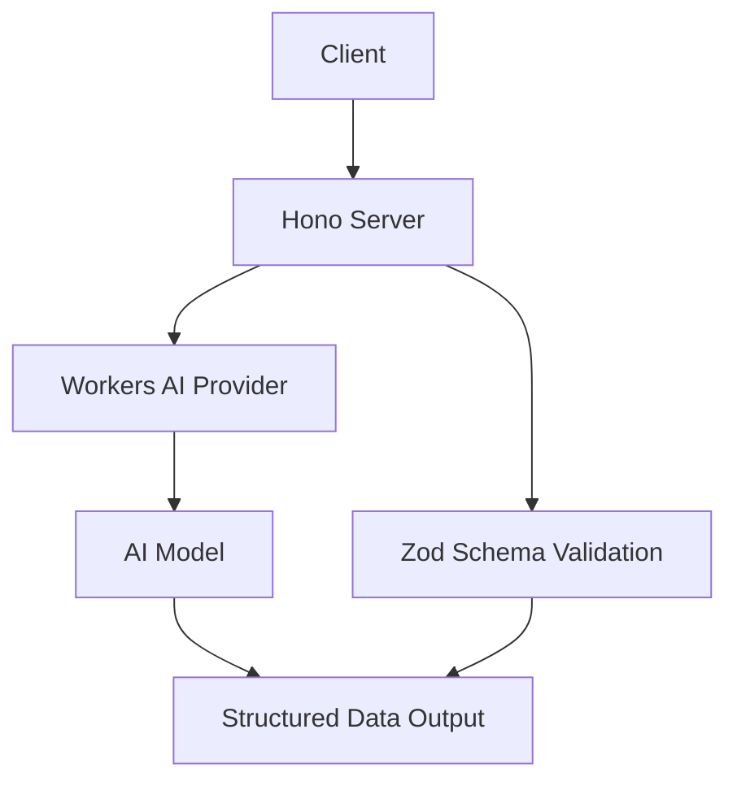
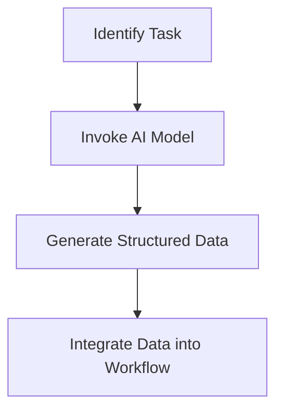

# Structured Output

Structured Output is a project designed to generate structured data objects from natural language prompts using AI models. It leverages the power of large language models to interpret and transform user inputs into predefined data structures, making it ideal for applications requiring structured data generation from unstructured text.

## Table of Contents
1. [Overview](#overview)
2. [Usage](#usage)
3. [Architecture](#architecture)

## Overview
The Structured Output project aims to provide a seamless interface for generating structured data from natural language prompts. It utilizes AI models to parse and convert text inputs into structured JSON objects, specifically designed for applications like recipe generation, where the output needs to adhere to a specific schema.

The project is built using the Hono framework and integrates with AI models via the Workers AI provider. It includes a RESTful API that accepts POST requests with prompts and returns structured JSON objects.

## Usage
To start the project locally, use the following command:

```bash
npx nx dev structured-output
```

### NPM Scripts
- **deploy**: Deploys the application using Wrangler.
  ```bash
  npx nx deploy structured-output
  ```
- **dev**: Starts the development server using Wrangler.
  ```bash
  npx nx dev structured-output
  ```
- **lint**: Lints the source code using Biome.
  ```bash
  npx nx lint structured-output
  ```
- **start**: Alias for `dev`, starts the development server.
  ```bash
  npx nx start structured-output
  ```
- **test**: Runs the test suite using Vitest.
  ```bash
  npx nx test structured-output
  ```
- **test:ci**: Runs the test suite in CI mode.
  ```bash
  npx nx test:ci structured-output
  ```
- **type-check**: Performs TypeScript type checking.
  ```bash
  npx nx type-check structured-output
  ```

### API Usage
The project exposes a RESTful API with the following endpoint:

- **POST /**
  - **Description**: Generates a structured data object from a given prompt.
  - **Request Format**:
    ```json
    {
      "prompt": "Create a recipe for sourdough bread."
    }
    ```
  - **Response Format**:
    ```json
    {
      "recipe": {
        "name": "Sourdough Bread",
        "ingredients": [
          { "name": "Flour", "amount": "500g" },
          { "name": "Water", "amount": "300ml" }
        ],
        "steps": [
          "Mix ingredients",
          "Knead dough",
          "Let it rise"
        ]
      }
    }
    ```
  - **Curl Command**:
    ```bash
    curl -X POST \
    -H "Content-Type: application/json" \
    -d '{"prompt": "Create a recipe for sourdough bread."}' \
    http://localhost:8787/
    ```

## Architecture
The architecture of the Structured Output project is designed to efficiently handle natural language processing tasks and generate structured outputs. It consists of the following main components:

- **Hono Framework**: Serves as the web server framework, handling HTTP requests and responses.
- **Workers AI Provider**: Integrates AI models to process prompts and generate structured data.
- **Zod Schema Validation**: Ensures the generated data adheres to the predefined schema.

### System Diagram


### Tool Use Pattern
The project employs the Tool Use Pattern, where the AI model dynamically interacts with external tools (in this case, the Workers AI provider) to extend its capabilities. This pattern involves identifying the task, invoking the appropriate tool, and integrating the returned data into the workflow.

