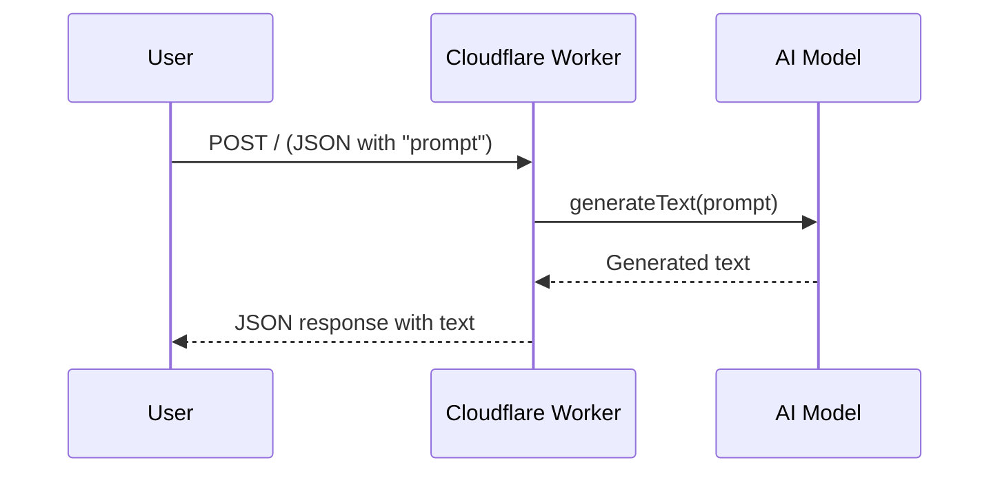

# Text Generation Worker

Welcome to **Text Generation**, a Cloudflare Worker that leverages powerful Large Language Models (LLMs) via [`workers-ai-provider`](https://developers.cloudflare.com/workers/ai/) to generate human-like text on demand. This worker is orchestrated through Nx, making development, testing, and deployment straightforward. Below you will find everything you need to get started, from installation to usage.

---

## Overview

This worker is designed to accept a prompt from the user, generate a text response using a model provisioned through Cloudflare’s AI bindings, and return the generated text as JSON. The worker taps into the `@cf/meta/llama-3.3-70b-instruct-fp8-fast` model by default, but you can configure it to your preference.

Essentially, the process is:
1. A user submits a **prompt** via a `POST` request.
2. The worker takes this prompt and sends it to the AI model (using `workers-ai-provider`).
3. The AI model produces a response.
4. The response is returned as JSON to the user.

---

## Repository Structure

- **`apps/text-generation/`**  
  The main directory for this worker, containing:
  - `wrangler.jsonc` configuration for Cloudflare Worker deployment.
  - `package.json` scripts for building, deploying, and running locally.
  - `vitest.config.ts` for test settings.
  - `src/` folder containing:
    - `index.ts`: Entry point of the worker.
    - `types/` folder for TypeScript type definitions.

---

## How to Use

### 1. Development

1. Ensure you have all dependencies installed (run `npm install` in your repository root).
2. Start your local development server:
   ```bash
   npx nx dev text-generation
   ```
Under the hood, this calls:
   ```bash
   wrangler dev -e development
   ```
The Worker will start locally at `http://localhost:8787` by default.

### 2. Sending Requests

To interact with the worker, simply send a `POST` request to `http://localhost:8787/`, with a JSON body:

```json
{
  "prompt": "Tell me an interesting fact about honey badgers."
}
```

The worker will respond with JSON containing the generated text. For instance:

```json
{
  "text": "Honey badgers are known for their incredible resilience..."
}
```

### 3. Testing

This worker includes a minimal test setup using [Vitest](https://vitest.dev/). To run tests:

```bash
npx nx test text-generation
```

### 4. Linting and Type Checking

To ensure your code remains consistent and bug-free, use the following:

```bash
# Linting
npx nx lint text-generation

# Type Checking
npx nx type-check text-generation
```

### 5. Deployments

Deployment is managed by [Wrangler](https://developers.cloudflare.com/workers/wrangler/). You can deploy to **production** or **staging**. The relevant scripts are found in `package.json`:

```bash
# Production
npx nx deploy:production text-generation

# Staging
  
```

These commands correlate to the respective environments outlined in your `wrangler.jsonc`.

---

## Environment Configuration

All environment variables are declared in `wrangler.jsonc` under the `vars` property. For instance:
```jsonc
{
  "vars": {
    "ENVIRONMENT": "production"
  },
  "env": {
    "development": {
      "name": "text-generation-dev",
      "vars": {
        "ENVIRONMENT": "development"
      },
      "ai": {
        "binding": "AI"
      }
    }
  }
}
```

---

## Workflow Pattern

Here is a simplified sequence diagram to illustrate the worker’s internal flow:



1. **User** sends a `prompt`.
2. **Worker** relays the prompt to the LLM via `workers-ai-provider`.
3. **LLM** (running in Cloudflare's environment) computes the text.
4. **Worker** receives the generated output.
5. **Worker** returns the text as JSON.

This simple agentic pattern leverages Cloudflare’s AI binding (`AI`) to offload the heavy lifting of text generation.

---

## Technical Highlights

1. **Cloudflare AI Integration**:  
   This project demonstrates how to integrate Cloudflare’s new AI capabilities into a Worker, enabling powerful text generation features without needing external API calls to third-party providers.

2. **TypeScript Types**:  
   Clear and strict TypeScript types are set up in `types/` for a more robust and maintainable codebase.

3. **Simple to Extend**:  
   If you wish to use a different model, simply change the model identifier in the `generateText` call:

   ```ts
   generateText({
     model: workersai("model-identifier-here"),
     prompt,
   });
   ```

---

**Happy Text-generating!**
