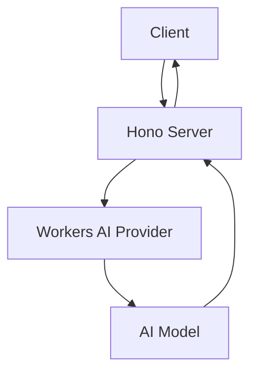
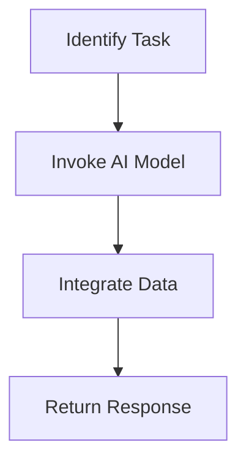

# Text Generation

This project is a text generation application that leverages AI models to generate text based on user prompts. It is designed to be deployed on a serverless platform, providing a scalable and efficient solution for text generation tasks.

## Table of Contents
1. [Overview](#overview)
2. [Usage](#usage)
3. [Architecture](#architecture)

## Overview
The Text Generation project is built to provide an API for generating text using AI models. It utilizes the Hono framework for handling HTTP requests and integrates with AI models through the Workers AI provider. The primary functionality is to accept a text prompt and return generated text based on that prompt.

## Usage
To start the project locally, use the following command:

```bash
npx nx dev text-generation
```

### NPM Scripts
- **deploy**: Deploys the application using Wrangler.
  ```bash
  npx nx deploy text-generation
  ```
- **dev**: Starts the development server using Wrangler.
  ```bash
  npx nx dev text-generation
  ```
- **lint**: Lints the source code using Biome.
  ```bash
  npx nx lint text-generation
  ```
- **start**: Alias for `dev`, starts the development server.
  ```bash
  npx nx start text-generation
  ```
- **test**: Runs the test suite using Vitest.
  ```bash
  npx nx test text-generation
  ```
- **test:ci**: Runs the test suite in CI mode using Vitest.
  ```bash
  npx nx test:ci text-generation
  ```
- **type-check**: Performs TypeScript type checking.
  ```bash
  npx nx type-check text-generation
  ```

### API Endpoint
- **POST /**: Generates text based on the provided prompt.
  - **Request**:
    - Method: POST
    - Headers: `Content-Type: application/json`
    - Body: `{ "prompt": "Your text prompt here" }`
  - **Response**:
    - Content-Type: `application/json`
    - Body: `{ "generatedText": "Generated text based on the prompt" }`
  - **Curl Command**:
    ```bash
    curl -X POST \
    -H "Content-Type: application/json" \
    -d '{ "prompt": "Your text prompt here" }' \
    http://localhost:8787/
    ```

## Architecture
The application is structured as a serverless function using the Hono framework. It integrates with AI models via the Workers AI provider, allowing for scalable and efficient text generation.

### System Diagram


### Tool Use Pattern
The application uses the Tool Use Pattern by dynamically interacting with the Workers AI provider to generate text. This pattern allows the application to extend its capabilities by leveraging external AI models for text generation.

