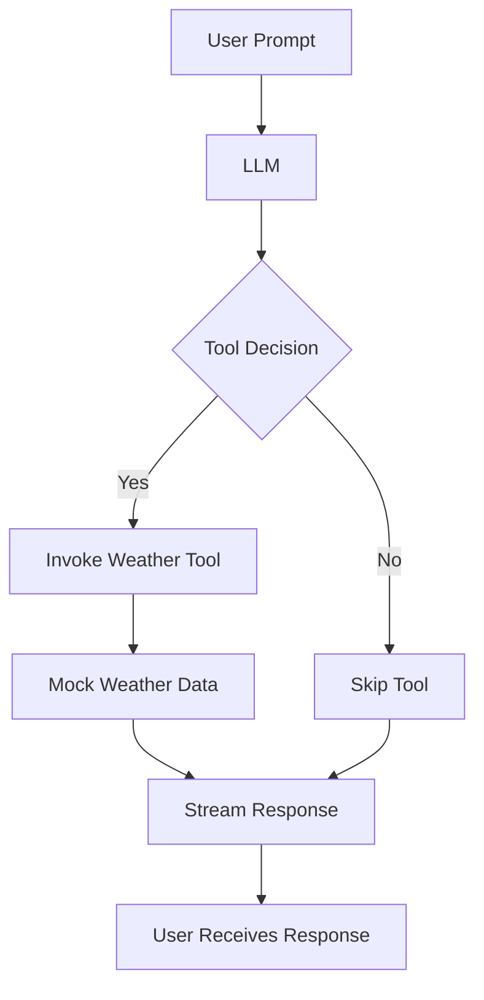
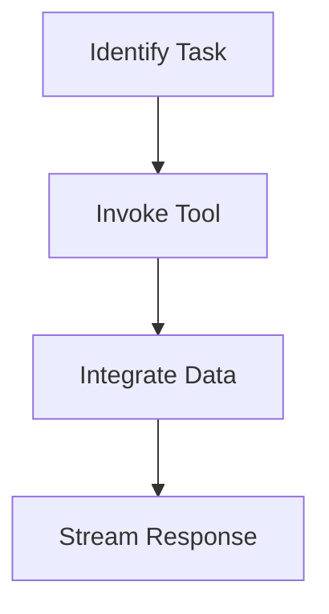

# Tool Calling Stream Traditional

Welcome to **Tool Calling Stream Traditional**, a Cloudflare Worker that demonstrates how a Large Language Model (LLM) can decide whether to call an external "tool" during the conversation flow. It then returns the result in a streamed response. This worker includes an example "weather tool" for illustrative purposes and shows how you might build a flexible workflow when combining AI inference and tool-calling.

## Table of Contents
- [Overview](#overview)
- [Usage](#usage)
- [Architecture](#architecture)

## Overview
This worker:
1. Accepts a prompt from the user.
2. Passes the prompt to an LLM capable of calling tools.
3. Inspects the tool calls chosen by the LLM.
4. Mocks a response from the "weather tool" for demonstration.
5. Streams the final AI response back to the client.

### Key Highlights
- **Tool-calling**: The AI can invoke specific tools based on the conversation context.  
- **Streaming**: The final output from the LLM is streamed back for a more dynamic user experience.  
- **Multiple Environments**: Easily configurable for `production`, `staging`, and `development`.

Below is a quick diagram illustrating the flow:

```mermaid
graph LR
    A[User Prompt] --> B[LLM Invoked]
    B --> C{Does LLM call a tool}
    C -- Yes --> D[AI selects Tool e.g. "get_weather"]
    D --> E[Weather Data Mocked]
    C -- No --> F[No Tool Called]
    E --> F[Assemble Response]
    F --> G[Stream Final Response to User]
```

## Usage

### Local Development
To run the Worker in local development mode:
```bash
npx nx dev tool-calling-stream-traditional
```
This command uses **Wrangler** under the hood (`wrangler dev -e development`) to spin up a local server.

Alternatively, you may also use:
```bash
npx nx start tool-calling-stream-traditional
```
Both commands are equivalent here; pick whichever you prefer.

Once running, you can send an HTTP `POST` request to `http://localhost:8787/` with a JSON payload containing:
```json
{
  "prompt": "What is the weather in London?"
}
```
The Worker will:
1. Forward the user prompt to the LLM.
2. Potentially call the `get_weather` tool if needed.
3. Return a streamed response indicating the AI’s final message.

### Deploying

You can deploy to one of the configured environments using the following scripts:

**Production**:
```bash
npx nx deploy:production tool-calling-stream-traditional
```

**Staging**:
```bash
npx nx deploy:staging tool-calling-stream-traditional
```

This will use Wrangler to deploy your Worker to your configured Cloudflare account, applying the environment-specific settings in `wrangler.jsonc`.

### Testing and Linting

1. **Unit Tests**
   ```bash
   npx nx test tool-calling-stream-traditional
   ```
   This runs Vitest in watch=false mode.

2. **Linting**
   ```bash
   npx nx lint tool-calling-stream-traditional
   ```
   Uses Biome to check for code cleanliness. Warnings are treated as errors.

3. **Type Checking**
   ```bash
   npx nx type-check tool-calling-stream-traditional
   ```
   Ensures TypeScript definitions are consistent.

## Architecture

### System Diagram



### Tool Use Pattern
The project employs the **Tool Use Pattern**, where the LLM dynamically interacts with external tools. This pattern involves identifying tasks, invoking appropriate tools, and integrating returned data into the workflow. In this project, the LLM decides whether to call the "get_weather" tool based on the user's prompt and streams the final response back to the user.



This README provides a comprehensive guide to understanding and using the **Tool Calling Stream Traditional** project, highlighting its architecture and usage patterns.