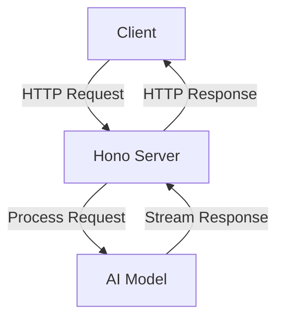
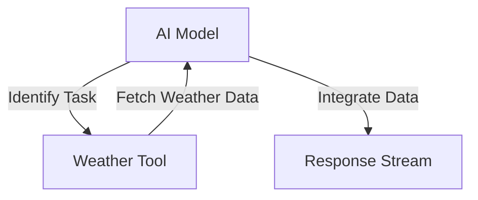

# Tool Calling Stream

Tool Calling Stream is a project designed to provide a streaming interface for AI models, allowing for dynamic tool usage and interaction. It leverages the Hono framework to create a server that can handle AI model requests and stream responses back to the client.

## Table of Contents
1. [Overview](#overview)
2. [Usage](#usage)
3. [Architecture](#architecture)

## Overview
The Tool Calling Stream project serves as a streaming interface for AI models, specifically designed to handle requests and provide responses in a streaming manner. It utilizes the Hono framework to set up a server that can process AI model interactions, allowing for dynamic tool usage such as weather information retrieval. The project is structured to support various environments, including production, development, and staging.

## Usage
To start the project locally, you can use the following npm scripts:

- `npx nx dev tool-calling-stream`: Starts the development server using Wrangler.
- `npx nx deploy tool-calling-stream`: Deploys the application using Wrangler.
- `npx nx lint tool-calling-stream`: Lints the source code using Biome, ensuring code quality and consistency.
- `npx nx start tool-calling-stream`: An alias for starting the development server.
- `npx nx test tool-calling-stream`: Runs the test suite using Vitest.
- `npx nx test:ci tool-calling-stream`: Runs the test suite in continuous integration mode, without watching for changes.
- `npx nx type-check tool-calling-stream`: Performs TypeScript type checking without emitting output files.

### API Interaction
The project exposes an API with the following endpoints:

#### POST /
- **Description**: Streams AI model responses based on the provided prompt.
- **Request Format**:
  ```json
  {
    "prompt": "Your prompt here"
  }
  ```
- **Response Format**: Streams text responses from the AI model.
- **Curl Command**:
  ```bash
  curl -X POST \
  -H "Content-Type: application/json" \
  -d '{"prompt": "What is the weather in London?"}' \
  http://localhost:8787/
  ```

## Architecture
The architecture of the Tool Calling Stream project is designed to handle AI model requests and stream responses efficiently. It uses the Hono framework to manage HTTP requests and responses, and integrates with AI models to provide dynamic tool usage.

### System Diagram


### Tool Use Pattern
The project employs the Tool Use Pattern, where the AI model dynamically interacts with external tools to extend its capabilities. In this case, the AI model can fetch weather information based on user prompts.



This pattern allows the AI model to enhance its responses by incorporating real-time data from external sources, providing more accurate and relevant information to users.