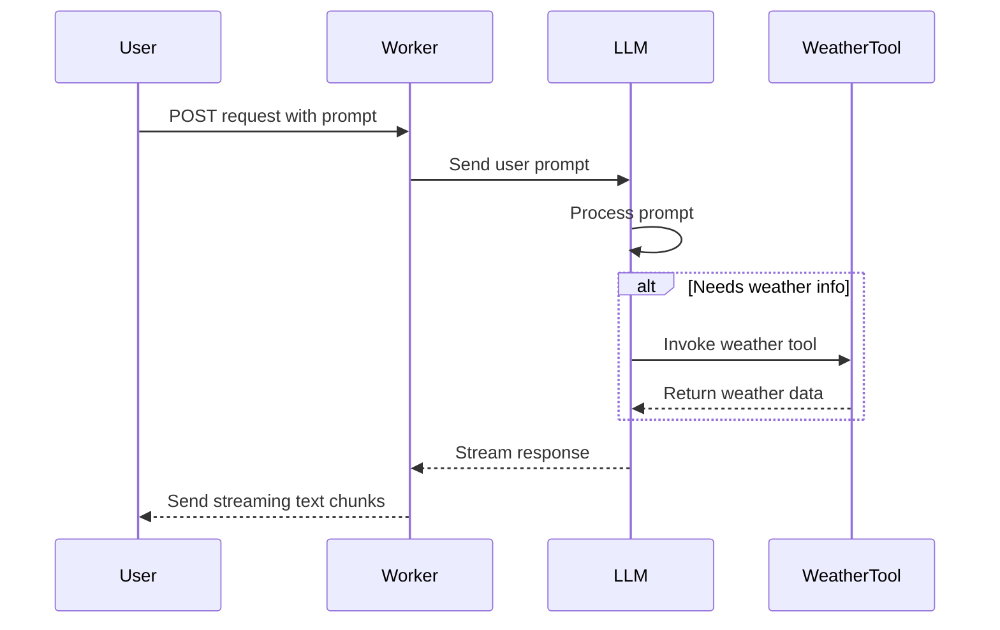

# Tool-Calling-Stream Worker

Welcome to **tool-calling-stream**, a Cloudflare Worker project designed to demonstrate conversational AI interactions **with** tool usage, all in a streaming fashion. In other words, this Worker makes it possible to ask a question and have an AI model respond in real time, calling external “tools” (like a weather service) as needed.

This project highlights several interesting patterns:
1. **Streaming response**: The AI’s response is streamed back progressively rather than sent all at once, allowing real-time updates.
2. **Agentic tool-calling**: The AI model can invoke a “tool” (in this case, a weather function) to improve responses. These calls are made “under the hood” but can be traced.
3. **Multiple environments**: By using the `wrangler.jsonc` configuration, different environments (production, staging, and development) can be deployed quickly.

---

## What It Does

When a user sends a `POST` request to the Worker’s root endpoint (`/`), the Worker:
1. Forwards the user’s prompt to an AI model via [`workers-ai-provider`](https://www.npmjs.com/package/workers-ai-provider).
2. Permits the AI model to invoke additional tools, such as the built-in “weather” tool, to augment its response.
3. Streams the AI model’s answer back to the caller in chunks, so the client can start reading the response without waiting for the entire answer to be generated.

Example usage:
```bash
curl -X POST http://localhost:8787/ \
  -H 'Content-Type: application/json' \
  -d '{"prompt": "What is the weather in London?"}'
```
The Worker will respond with a text stream containing the AI’s reply, which might include “Raining” after it calls the weather tool.

---

## How to Run Locally

From the **root of the repository**, you can invoke the following **Nx** commands with the project name (`tool-calling-stream`) to manage and run this Worker.

### 1. Start Development Server
```bash
npx nx dev tool-calling-stream
```
This command uses `wrangler dev` under the hood, launching the Worker on a local development server (usually at [http://localhost:8787](http://localhost:8787)).

### 2. Lint
```bash
npx nx lint tool-calling-stream
```
Runs [Biome](https://biomejs.dev/) linting on the codebase to ensure it meets style and code-quality conventions.

### 3. Type-Check
```bash
npx nx type-check tool-calling-stream
```
Uses TypeScript to verify type correctness without emitting compiled files.

### 4. Test
```bash
npx nx test tool-calling-stream
```
Starts the local development server in the background, runs [Vitest](https://vitest.dev/) test suites (including integration tests), and then cleans up the server.

### 5. Deploy
```bash
# For production:
npx nx deploy:production tool-calling-stream

# For staging:
npx nx deploy:staging tool-calling-stream
```
Deploys the Worker using `wrangler deploy` to the specified environment.

---

## Interesting Architectural Pattern

Below is a conceptual view of the **agentic** workflow, where the AI model can “step outside” to call a tool (the weather checker) before continuing its response. This allows for more powerful, context-rich answers.



---

## Additional Notes

- **`wrangler.jsonc`** configures environment variables, AI bindings, and environment-specific settings.
- The tool (called “weather”) is defined with [Zod](https://zod.dev/) schemas to ensure correct input handling.
- [`streamText`](https://www.npmjs.com/package/ai) drives the streaming response, which is returned as a chunked HTTP response so the client can read as soon as data is available.

We hope you find this Worker both enlightening and fun to experiment with. Feel free to extend its functionality by adding more tools, exploring other AI models, or integrating custom logic.

Happy building!
