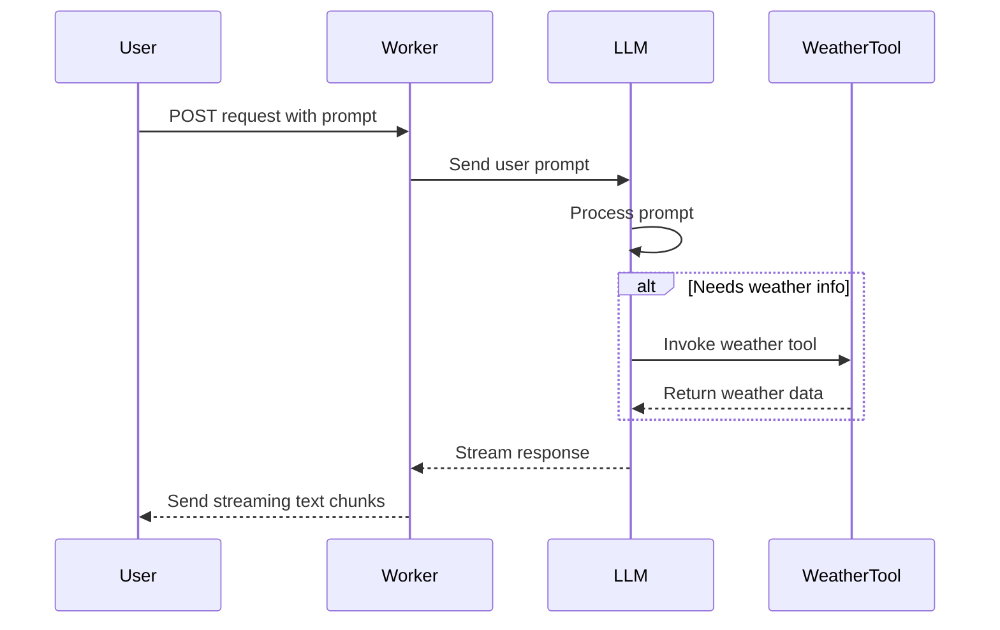

# Tool-Calling-Stream Worker

Welcome to **tool-calling-stream**, a Cloudflare Worker project designed to demonstrate conversational AI interactions with tool usage, all in a streaming fashion. In other words, this Worker makes it possible to ask a question and have an AI model respond in real time, calling external “tools” (like a weather service) as needed.

## Table of Contents
1. [Overview](#overview)
2. [Usage](#usage)
3. [Architecture](#architecture)

## Overview
The **tool-calling-stream** project is a Cloudflare Worker that facilitates real-time AI interactions by streaming responses and invoking external tools to enhance the AI's capabilities. The primary purpose is to demonstrate how AI can be integrated with external services to provide enriched responses. The architecture leverages Cloudflare Workers for serverless deployment, ensuring scalability and low latency.

## Usage
To start the project locally, ensure you are in the root of the project directory and use the following commands:

### Start Development Server
```bash
npx nx dev tool-calling-stream
```
This command uses `wrangler dev` under the hood, launching the Worker on a local development server (usually at [http://localhost:8787](http://localhost:8787)).

### Lint
```bash
npx nx lint tool-calling-stream
```
Runs [Biome](https://biomejs.dev/) linting on the codebase to ensure it meets style and code-quality conventions.

### Type-Check
```bash
npx nx type-check tool-calling-stream
```
Uses TypeScript to verify type correctness without emitting compiled files.

### Test
```bash
npx nx test tool-calling-stream
```
Starts the local development server in the background, runs [Vitest](https://vitest.dev/) test suites (including integration tests), and then cleans up the server.

### Deploy
```bash
# For production:
npx nx deploy:production tool-calling-stream

# For staging:
npx nx deploy:staging tool-calling-stream
```
Deploys the Worker using `wrangler deploy` to the specified environment.

### API Usage
To interact with the API, send a `POST` request to the Worker’s root endpoint (`/`).

Example usage:
```bash
curl -X POST http://localhost:8787/ \
  -H 'Content-Type: application/json' \
  -d '{"prompt": "What is the weather in London?"}'
```
The Worker will respond with a text stream containing the AI’s reply, which might include “Raining” after it calls the weather tool.

## Architecture
The architecture of the **tool-calling-stream** project is designed to handle real-time AI interactions efficiently. Below is a conceptual view of the **agentic** workflow, where the AI model can “step outside” to call a tool (the weather checker) before continuing its response. This allows for more powerful, context-rich answers.



## Additional Notes
- **`wrangler.jsonc`** configures environment variables, AI bindings, and environment-specific settings.
- The tool (called “weather”) is defined with [Zod](https://zod.dev/) schemas to ensure correct input handling.
- [`streamText`](https://www.npmjs.com/package/ai) drives the streaming response, which is returned as a chunked HTTP response so the client can read as soon as data is available.

We hope you find this Worker both enlightening and fun to experiment with. Feel free to extend its functionality by adding more tools, exploring other AI models, or integrating custom logic.

Happy building!