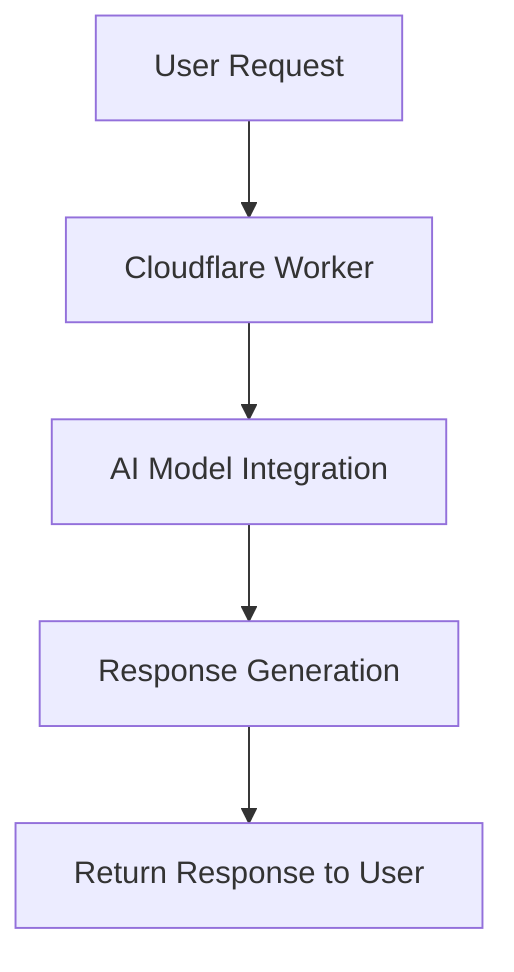
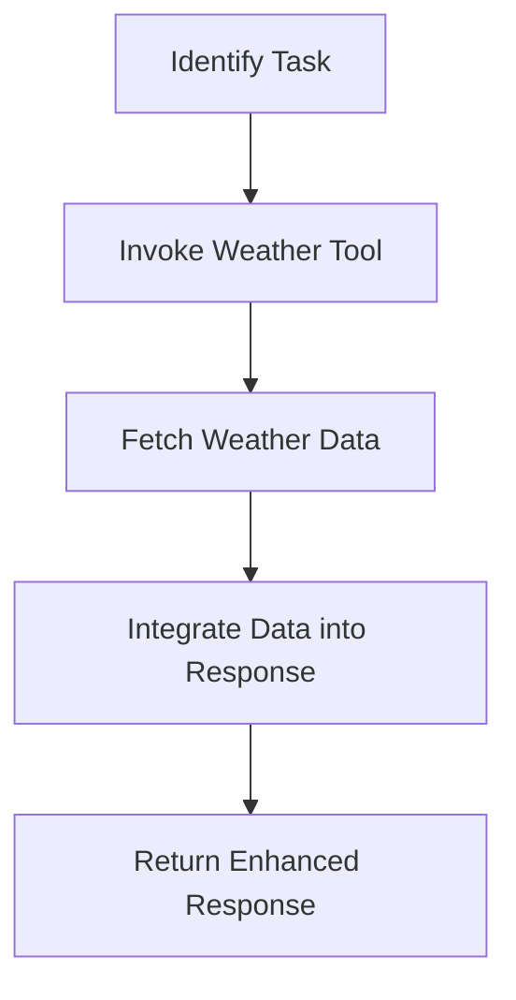

# Tool Calling

Tool Calling is a project designed to demonstrate the integration of AI capabilities within a serverless environment. It leverages AI models to provide dynamic responses to user prompts, including weather information based on location.

## Table of Contents
- [Overview](#overview)
- [Usage](#usage)
- [Architecture](#architecture)

## Overview
The Tool Calling project serves as an AI-powered API that processes user prompts and returns relevant information. It utilizes a serverless architecture with Cloudflare Workers and integrates AI models to generate responses. The primary functionality includes providing weather information based on user-specified locations.

## Usage
To start the project locally, use the following command:
```bash
npx nx dev tool-calling
```
This command runs the project in development mode using Cloudflare's Wrangler tool.

### NPM Scripts
- **deploy**: Deploys the application to the Cloudflare environment.
  ```bash
  npx nx deploy tool-calling
  ```
- **dev**: Starts the development server for local testing.
  ```bash
  npx nx dev tool-calling
  ```
- **lint**: Lints the source code to ensure code quality.
  ```bash
  npx nx lint tool-calling
  ```
- **start**: An alias for the `dev` script, starts the development server.
  ```bash
  npx nx start tool-calling
  ```
- **test**: Runs the test suite using Vitest.
  ```bash
  npx nx test tool-calling
  ```
- **test:ci**: Runs the test suite in continuous integration mode.
  ```bash
  npx nx test:ci tool-calling
  ```
- **type-check**: Performs TypeScript type checking.
  ```bash
  npx nx type-check tool-calling
  ```

### API Usage
The project exposes an API with the following endpoint:

#### POST /
- **Description**: Processes a user prompt and returns AI-generated text.
- **Request Format**:
  ```json
  {
    "prompt": "What is the weather in London?"
  }
  ```
- **Response Format**:
  ```json
  {
    "text": "The weather in London is rainy."
  }
  ```
- **Curl Command**:
  ```bash
  curl -X POST \
    -H "Content-Type: application/json" \
    -d '{"prompt": "What is the weather in London?"}' \
    http://localhost:8787/
  ```

## Architecture
The Tool Calling project is built using a serverless architecture with Cloudflare Workers. It integrates AI models to process user prompts and generate responses. The architecture includes the following components:



### Tool Use Pattern
The project employs the Tool Use Pattern, where the AI dynamically interacts with external tools to extend its capabilities. In this case, it uses a weather tool to fetch weather information based on the user's location.

