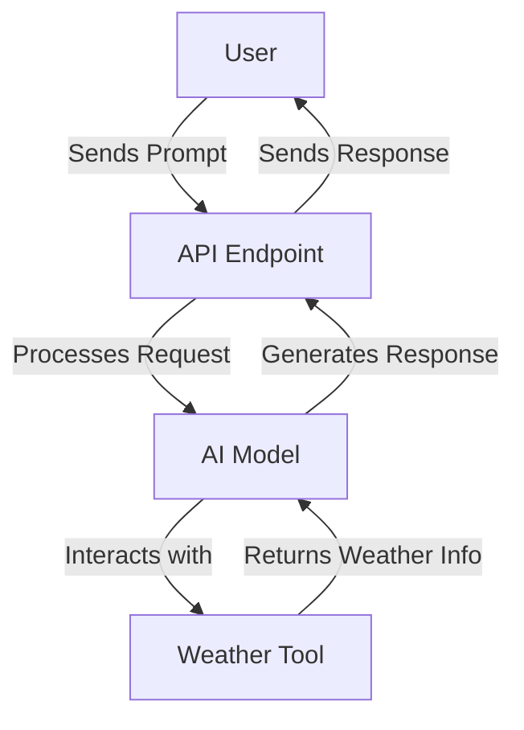
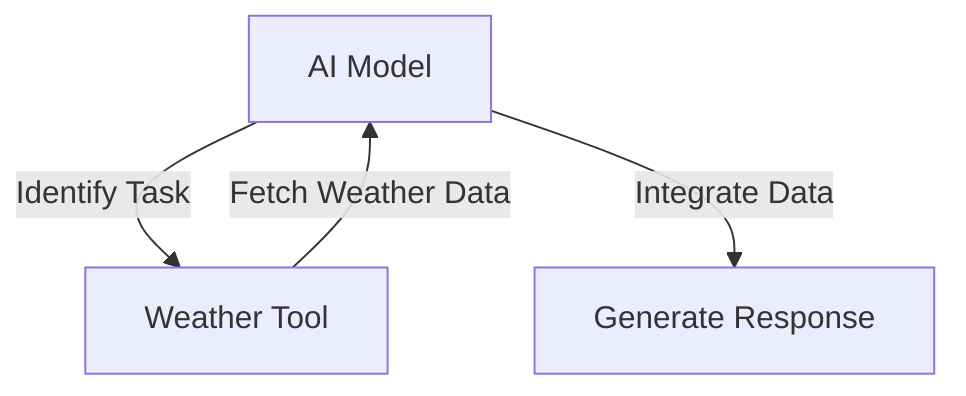

# Tool Calling

Tool Calling is a project designed to demonstrate the integration of AI capabilities within a serverless environment. It leverages AI models to provide dynamic responses to user prompts, including weather information based on location.

## Table of Contents
1. [Overview](#overview)
2. [Usage](#usage)
3. [Architecture](#architecture)

## Overview
The Tool Calling project serves as an AI-powered API that processes user prompts to generate responses using a language model. It includes a weather tool that provides weather information for specified locations. The project is built using the Hono framework and is designed to run on Cloudflare Workers, making it scalable and efficient.

## Usage
To start the project locally, use the following command:
```bash
npx nx dev tool-calling
```
This command runs the project in development mode using Wrangler.

### NPM Scripts
- **deploy**: Deploys the project to the Cloudflare Workers environment.
  ```bash
  npx nx deploy tool-calling
  ```
- **dev**: Starts the development server for local testing.
  ```bash
  npx nx dev tool-calling
  ```
- **lint**: Lints the source code using Biome.
  ```bash
  npx nx lint tool-calling
  ```
- **start**: An alias for `dev`, starts the development server.
  ```bash
  npx nx start tool-calling
  ```
- **test**: Runs the test suite using Vitest.
  ```bash
  npx nx test tool-calling
  ```
- **test:ci**: Runs the test suite in CI mode, without watching for changes.
  ```bash
  npx nx test:ci tool-calling
  ```
- **type-check**: Performs TypeScript type checking.
  ```bash
  npx nx type-check tool-calling
  ```

### API Usage
The project exposes an API with the following endpoint:

#### POST /
- **Description**: Processes a user prompt and returns a generated response.
- **Request Format**:
  ```json
  {
    "prompt": "What is the weather in London?"
  }
  ```
- **Response Format**:
  ```json
  {
    "text": "The weather in London is rainy."
  }
  ```
- **Curl Command**:
  ```bash
  curl -X POST \
    -H "Content-Type: application/json" \
    -d '{"prompt": "What is the weather in London?"}' \
    http://localhost:8787/
  ```

## Architecture
The Tool Calling project is structured to run on Cloudflare Workers, utilizing the Hono framework for handling HTTP requests. The AI capabilities are powered by a language model that processes user prompts and interacts with a weather tool to provide location-based weather information.

### System Diagram


### Tool Use Pattern
The project employs the Tool Use Pattern, where the AI model dynamically interacts with external tools to extend its capabilities. In this case, the AI model uses a weather tool to fetch and integrate weather data into its responses.




<!-- Last updated: 038947bb9b4fd6d8d05f28479e966cd36b43658e -->