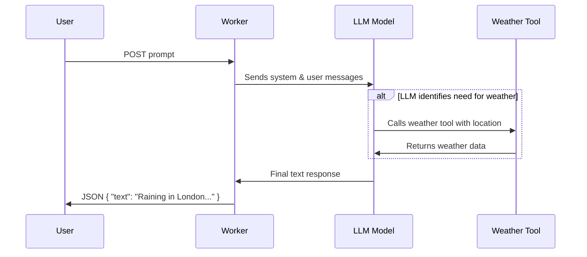

# Tool Calling Worker

Welcome to **Tool Calling**, a lively Cloudflare Worker that exemplifies the interplay between AI-driven text generation and external tool calls. This Worker leverages the [`workers-ai-provider`](https://www.npmjs.com/package/workers-ai-provider) package to communicate with an LLM, and demonstrates how to invoke specific “tools” (in this case, a weather lookup) whenever a user’s query requires extra information.

## Table of Contents

- [Overview](#overview)
- [How It Works](#how-it-works)
- [Usage](#usage)
- [Commands](#commands)
- [Development & Deployment](#development--deployment)
- [Testing](#testing)
- [Agentic Flow Diagram](#agentic-flow-diagram)
- [File Structure](#file-structure)

---

## Overview

The Tool Calling Worker provides an endpoint that uses AI to generate responses to user prompts. If the AI model believes it needs specific data to answer correctly, it will invoke the relevant tool—in this case, a simple weather service—before producing its final output.

This Worker:
- Accepts a user prompt at the root endpoint (`POST /`).
- Passes this prompt, along with a simple system context, to an LLM model (here, `@cf/meta/llama-3.3-70b-instruct-fp8-fast`).
- Dynamically calls the **weather** tool if the LLM requests it.
- Returns a JSON object containing the model’s final text response.

---

## How It Works

1. **Prompt Reception**  
   A `POST` request is made to the Worker’s root (`/`), containing a JSON body of the form:
   ```json
   {
     "prompt": "What is the weather in London?"
   }
   ```

2. **Tool Declaration**  
   Inside the Worker, we declare a `weather` tool using [`zod`](https://www.npmjs.com/package/zod) to validate the structure of its parameters. The tool is programmed to respond with either `"Raining"` for London or `"Sunny"` for any other location.

3. **Generate Text**  
   Using `generateText` from the `ai` package:
  - The Worker sets up system and user messages.
  - The AI is given a chance to decide if it needs to call the weather tool.
  - If needed, a tool call is made, retrieving any extra info (in this example, the weather).
  - The LLM then incorporates these retrieved details into its final response.

4. **Response**  
   The Worker sends back a JSON response like:
   ```json
   {
     "text": "It looks like it is raining in London at the moment."
   }
   ```

---

## Usage

**Run the development server** by executing:
```bash
npx nx dev tool-calling
```
This command spins up the Worker in development mode, binding it to the configured `development` environment settings. You may then issue requests (e.g., using `curl` or Postman) to `http://localhost:8787/`.

**Example request**:
```bash
curl -X POST \
     -H "Content-Type: application/json" \
     -d '{"prompt":"What is the weather in London?"}' \
     http://localhost:8787/
```

---

## Commands

In the `package.json`, you will find several scripts for your convenience:

- `dev`: Starts the local development server with `wrangler dev` in the `development` environment.
- `deploy:production`: Deploys the production Worker with `wrangler deploy`.
- `deploy:staging`: Deploys the staging environment Worker with `wrangler deploy -e staging`.
- `lint`: Runs a linter (`biome`) across the `src` folder.
- `test`: Launches the development server and runs integration tests in parallel.
- `test:ci`: Suitable for CI pipelines – runs tests without watching, ensuring it exits with an appropriate status code.
- `type-check`: Checks for TypeScript type errors without emitting compiled files.

---

## Development & Deployment

1. **Local Development**
  - Make sure your environment includes any required secrets (e.g., `OPENAI_API_KEY`) stored in `Wrangler`.
  - Run `npx nx dev prompt-chaining` or `npm run dev` to start hacking away.

2. **Staging Deployment**
   ```bash
   npm run deploy:staging
   ```
   This will deploy the Worker to your staging environment (defined in `wrangler.jsonc` as `tool-calling-staging`).

3. **Production Deployment**
   ```bash
   npm run deploy:production
   ```
   This will build and deploy the Worker to the production environment, named `tool-calling` in `wrangler.jsonc`.

---

## Testing

Integration tests are provided within [`integration.test.ts`](./src/integration.test.ts). They:
- Start the Worker in the background on `http://localhost:8787`.
- Issue repeated queries (e.g., “What is the weather in London?”).
- Check that the returned text contains expected keywords (e.g., “rain” or “sunny”).

To run the tests:
```bash
# in watch mode
npx nx test tool-calling
```
or
```bash
npx nx test:ci tool-calling
```
The reliability test framework ensures we only pass when at least 75% of requests (`PASSING_THRESHOLD = 0.75`) yield the correct response.

---

## Agentic Flow Diagram

Below is a simple diagram demonstrating how the worker orchestrates conversation flows and tool calls:



---

## File Structure

Key files and directories:

- **`apps/tool-calling/wrangler.jsonc`**  
  Defines Wrangler settings, environment variables, names for each environment, and AI bindings.

- **`apps/tool-calling/package.json`**  
  Contains scripts for development, deployment, and testing.

- **`apps/tool-calling/vitest.config.ts`**  
  Configures the Vitest testing framework.

- **`apps/tool-calling/src/index.ts`**  
  Main entry point for the Worker, containing the routing logic and AI text generation call.

- **`apps/tool-calling/src/types/`**
  - `hono.ts`: Defines type aliases for the Hono server context.
  - `env.ts`: Declares the `Env` interface for environment variables.

- **`apps/tool-calling/src/integration.test.ts`**  
  Integration tests verifying reliability of the Worker’s AI responses.

---

**Enjoy exploring the tool-calling Worker!** It demonstrates how you can seamlessly integrate language model prompts with tool-based lookups in a Cloudflare Worker environment. Feel free to adapt and extend it to your needs.
