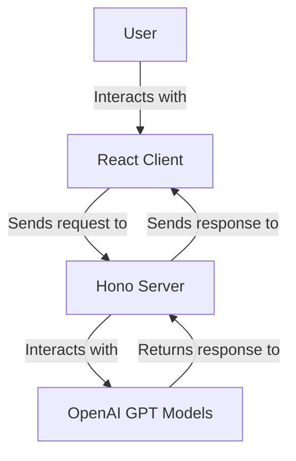
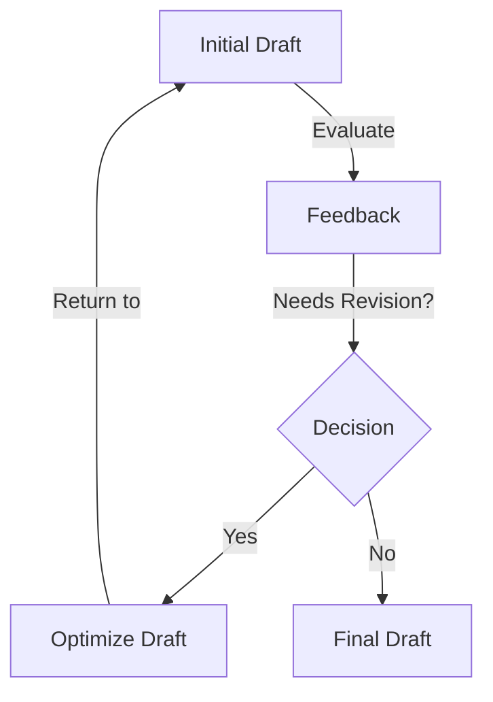

# UI Worker

This project is a web application designed to facilitate chat interactions using AI models. It leverages Vite for development and build processes, and integrates with OpenAI's GPT models to generate, evaluate, and optimize text drafts.

## Table of Contents
- [Overview](#overview)
- [Usage](#usage)
- [Architecture](#architecture)

## Overview
The UI Worker project is a chat application that allows users to interact with AI models to generate and refine text drafts. It uses a client-server architecture where the client is built with React and Mantine for UI components, and the server is built with Hono to handle API requests. The server interacts with OpenAI's GPT models to perform text generation and optimization tasks.

## Usage
To start the project locally, use the following command:
```
npx nx dev ui-worker
```

### NPM Scripts
- **dev**: Starts the development server using Vite.
- **build**: Builds the project for production using Vite.
- **lint**: Lints the source code using Biome.
- **preview**: Builds the project and starts a local server to preview the production build.
- **deploy**: Builds the project and deploys it using Wrangler.
- **test**: Runs the test suite using Vitest.
- **test:ci**: Runs the test suite in continuous integration mode using Vitest.
- **type-check**: Checks TypeScript types without emitting files.

### API Usage
The project exposes an API endpoint at `/api` for text generation and optimization. Here is how you can interact with it:

#### Request
- **Method**: POST
- **Endpoint**: `/api`
- **Headers**: `Content-Type: application/json`
- **Body**:
  ```json
  {
    "prompt": "Your text prompt here"
  }
  ```

#### Response
- **Success**: Returns a JSON object with the initial draft, evaluation feedback, and the final optimized draft.
  ```json
  {
    "initialDraft": "Initial draft text",
    "evaluation": {
      "feedback": "Feedback text",
      "needsRevision": true
    },
    "finalDraft": "Final optimized draft text"
  }
  ```

#### Example Curl Command
```bash
curl -X POST \
  http://localhost:3000/api \
  -H 'Content-Type: application/json' \
  -d '{"prompt": "Your text prompt here"}'
```

## Architecture
The UI Worker project follows a client-server architecture. The client is a React application that provides a chat interface for users. The server is built with Hono and handles API requests to interact with OpenAI's GPT models.

### System Diagram


### Agentic Patterns
The project uses the Evaluator-Optimizer pattern, where the AI models iteratively refine text drafts based on evaluation feedback.

#### Evaluator-Optimizer Pattern
This pattern involves an iterative refinement loop between task execution and evaluation.

