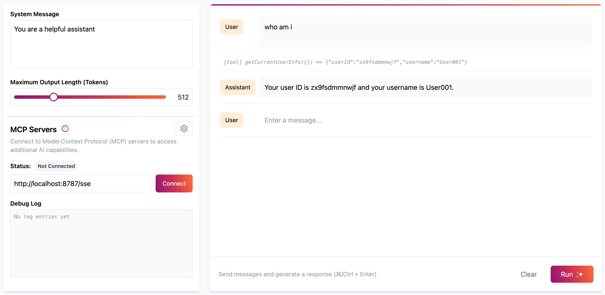

# Model Context Protocol (MCP) Server + Logto

This is a [Model Context Protocol (MCP)](https://modelcontextprotocol.io/introduction) server that supports remote MCP connections, with [Logto](https://logto.io/) authentication built-in.

The MCP server is powered by [Cloudflare Workers](https://developers.cloudflare.com/workers/):

- Acts as OAuth _Server_ to your MCP clients
- Acts as OIDC _Client_ to your Logto Tenant

## Getting Started

This demo allows an MCP Server to call a protected API on behalf of the authenticated user.

Before getting started, you need to create an account on [Logto Cloud](https://cloud.logto.io/) and create a Logto tenant, or deploy your own Logto instance using the [Logto open-source version](https://docs.logto.io/logto-oss).

### Configure Logto

1. In the Logto Console, navigate to the **Applications** page and create a **Traditional Web Application**.
2. In the Application details page, add the API Endpoint that the MCP Server uses to handle Logto authorization callbacks to the **Redirect URIs** (in our local testing, this Endpoint is `http://localhost:8788/callback`).
3. Take note of the Application's App ID, Logto Endpoint, and App Secret (the latter two are found in the Endpoints & Credentials Section), as they will be used in the environment variables later.

### Set up a KV namespace

1. Create the KV namespace:
```
wrangler kv:namespace create "OAUTH_KV"
```
2. Update the Wrangler file with the KV ID:
```
"kv_namespaces": [
  {
    "binding": "OAUTH_KV",
    "id": "<your-kv-id>"
  }
],
```

## Environment Variables

- `LOGTO_ENDPOINT`: The Logto Endpoint (e.g. `https://your-tenant-id.logto.app`)
- `LOGTO_APP_ID`: The Logto App ID
- `LOGTO_APP_SECRET`: The Logto App Secret


## Development

Create a `.dev.vars` file in the root of the project with the following structure:

```
LOGTO_ENDPOINT=https://your-tenant-id.logto.app
LOGTO_APP_ID=<your-logto-app-id>
LOGTO_APP_SECRET=<your-logto-app-secret>
```

## Test the MCP server locally

Run the following command in the project root:

```
npm run dev
```

Your MCP server will run on `http://localhost:8787`.

Then visit the Cloudflare Workers AI LLM Playground for testing, enter `http://localhost:8787/sse` in the MCP server URL, and click the `Connect` button.

A login page will appear. After completing the login process, you can interact with the LLM in the Playground and use the tools defined in your MCP server. For example, we ask the LLM "Who am I?":



## Deploying the MCP Server to Cloudflare

Before deploying to Cloudflare, you'll need to configure the following Logto-related secrets:

```bash
wrangler secret put LOGTO_ENDPOINT
wrangler secret put LOGTO_APP_ID
wrangler secret put LOGTO_APP_SECRET
```

After setting up the secrets, deploy your API by running:

```bash
npm run deploy
```

In your Logto Console, navigate to the related Application Details page and add the callback URL for your deployed MCP server to the Redirect URIs:

```bash
https://remote-mcp-logto.<your-subdomain>.workers.dev/callback
```

To test your deployment, head over to the Workers AI LLM Playground at [https://playground.ai.cloudflare.com/](https://playground.ai.cloudflare.com/). Look for the MCP server connection settings in the bottom left corner and enter your server URL:

```bash
https://remote-mcp-logto.<your-subdomain>.workers.dev/sse
```

When you connect, a Logto authentication window will appear. Once you complete the sign-in process, you'll have access to all available tools.

## Access the remote MCP server from Claude Desktop

Open Claude Desktop and navigate to Settings -> Developer -> Edit Config. This opens the configuration file that controls which MCP servers Claude can access.

Replace the content with the following configuration:

```
{
  "mcpServers": {
    "math": {
      "command": "npx",
      "args": [
        "mcp-remote",
        "https://remote-mcp-logto.<your-subdomain>.workers.dev/sse"
      ]
    }
  }
}
```

This configuration uses `npx` to run [the `mcp-remote` package](https://www.npmjs.com/package/mcp-remote) to access your Remote MCP Server by passing the URL in the `args`.  

Once you restart Claude Desktop, a browser window will open showing your OAuth login page. Complete the authentication flow to grant Claude access to your MCP server. After you grant access, the tools will become available for you to use.

Once the Tools (under 🔨) show up in the interface, you can ask Claude to use them. For example: "Could you list my todos". Claude should invoke the tool and show the result generated by the MCP server.
